# Rueidis 問題記錄

> 以下為所有請教問題的記錄

## 2022年1月27日

### 問題

當我看到 Redis 6 時，我在想一個問題當一個資料在 Redis 被改變時，是 Redis 會主動馬上通知我呢？還是我還要再去問 Redis ？看起來 Redis 不會主動通知我去更新 Cache，還要自已跑去問再去更新 Cache

 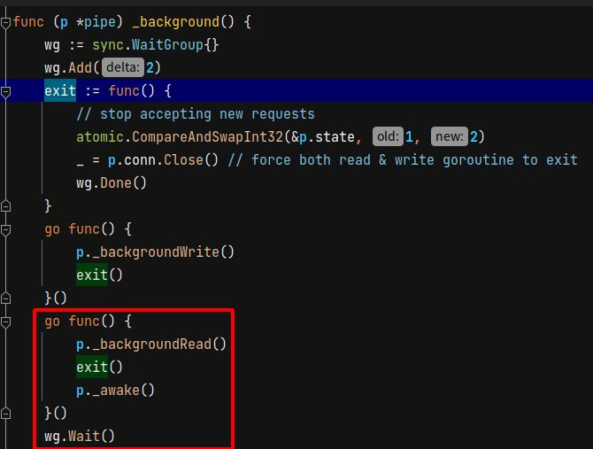

### 解答

如果有用到server-assisted client side caching 的話，Redis 會主動通知你喔圖片圈起來的部分是想問什麼問題呢？

### 問題

紅色圈起來的地方，像是程式碼主動去問 Redis，那如果不是，能否指出 Redis 會主動通知 Client 的程式碼位置？謝謝

### 解答

紅色圈起來的部分是程式在被動的讀取 redis 傳過來的訊息處理 redis invalidation notification 的地方是在裡面一點 [https://github.com/....../f957b83a911fc6....../pipe.go......](https://github.com/rueian/rueidis/blob/f957b83a911fc695a0a6137171d1a54e8a4724ce/pipe.go?fbclid=IwAR1uyznrRrjcTeuJiAaRJr7dEL_efS3U6hKj-G3r9lnOKh7ieqp6IbjRTRE#L271)

## 2022年2月3日

### 問題

pipe 的優點在程式碼裡可以看得到，DoMulti 函式可以處理向 Redis 傳送多條訊息，再一次讀取多條回應的結果

請教一下，我有看到您把 pipe 的連線用 Close() 函式關閉，pipe 的連線不就無法再繼續接收到 Redis 的新訊息了

那您是如何恢復 pipe 的連線的？

如果能的話，能否配合程式碼說明，謝謝

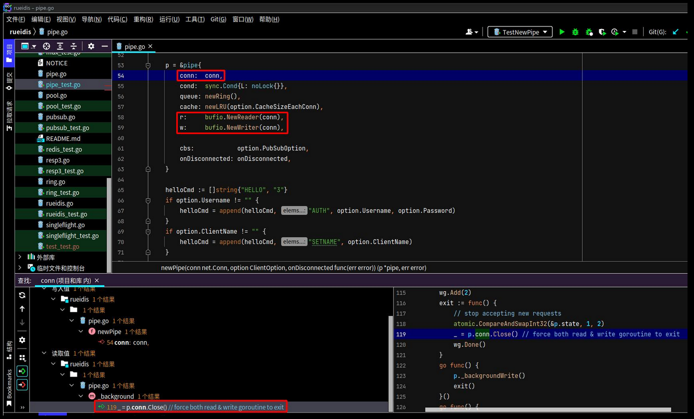

### 解答

走到那邊的話，的確是沒有要讀取之後的訊息了重新連線的部分可以看這裡 [https://github.com/....../02cd0ba16fe89a4....../mux.go......](https://github.com/rueian/rueidis/blob/02cd0ba16fe89a4635d93a7a1f7b05e4d3fb6be7/mux.go?fbclid=IwAR0dG2Jhzb9PT2cdhgZA1IW5ICAFm2V3GLsRmtgXl4fv8zZObUztz4drXKU#L89)

## 2022年2月10日

### 問題

這一段程式碼就可以看出是環狀結構環狀的數量為 2 的 n 次方，

比如 2^3 = 88 的二進制為 1000

環狀的數量減一的值為 77 的二進制為 0111

1000 和 0111 用 & 操作為 0

今天值只要一直增加，加到 8 時，用 & 操作，就直接跳回原點 0 就為環狀結構

請教一下，PutOne 和 PutMulti 兩個函式中，是否可以用 PutMulti 函式去取代 PutOne 函式的功能

可能您為了能節省效能，所以另外在多寫出 PutOne 函式

還是說 PutOne 和 PutMulti 有不同的意義和用途？謝謝

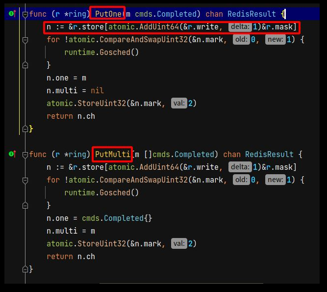 

### 解答

我也想用 PutMulti 取代 PutOne，不過還沒找到好方法另外你看的這份有點舊了，建議更新一下

## 2022年2月16日

### 問題

請教一個問題？

大部份 sync.WaitGroup 的 Done 會在 Wait 的前面請問為何這裡程式碼，為何 Wait 會在 Done 的前面，我是認為 _pipe() 會在不同的地方被執行，但細節我目前不清楚？

是否能說明運作流程？謝謝

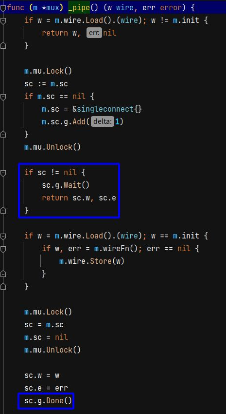 

### 解答

是的，_pipe 同時間會被很多地方呼叫，但我希望同時只有一個能呼叫到 wireFn。因此有拿到 WaitGroup 的就等待結果即可可以參考官方的 singleflight pkg

### 版務人員提供參考資料

可以參考這個解釋比較詳細[https://xnum.github.io/2018/11/syncmap-loadorstore](https://xnum.github.io/2018/11/syncmap-loadorstore?fbclid=IwAR0uCsXXgFhLKd4CZ4ohf_QOakmTVmcntztmPHG2T_l8f3OqpIuE3HKKPRk)

## 2022年2月23日

請教一個問題，我去看程式的流程，當使用 Pipe 時，最後要寫入 EOF 的訊息作為結束，代表沒有資料要傳送了p.background() 會傳入 Pipe EOF 訊息，但在比較後面，而且有 if 判斷式，代表不一定會執行

如果 p.background() 不及時執行的話，那不就代表 writeCmd(p.w, cmd.Commands()) 和syncRead(p.r) 會發生互相等待，那整個 syncDo 函式不會停止

我主要是想要請教 EOF 在程式碼裡是如何傳送和處理的？謝謝

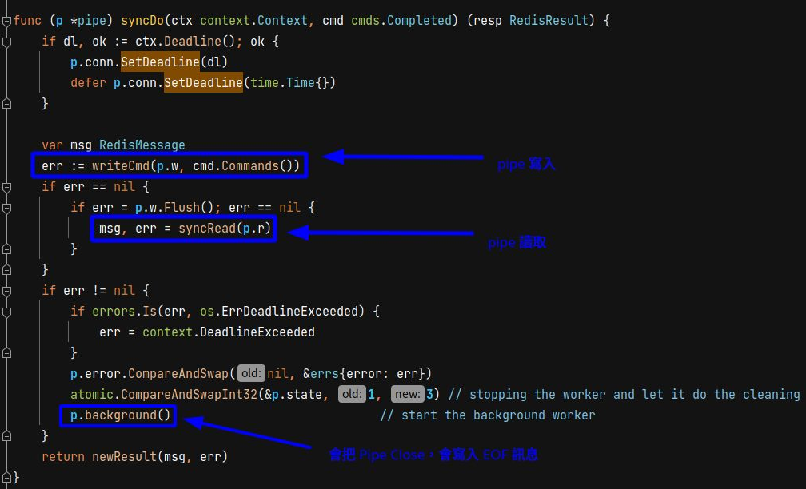

我預期 EOF 的寫入位置在這裡

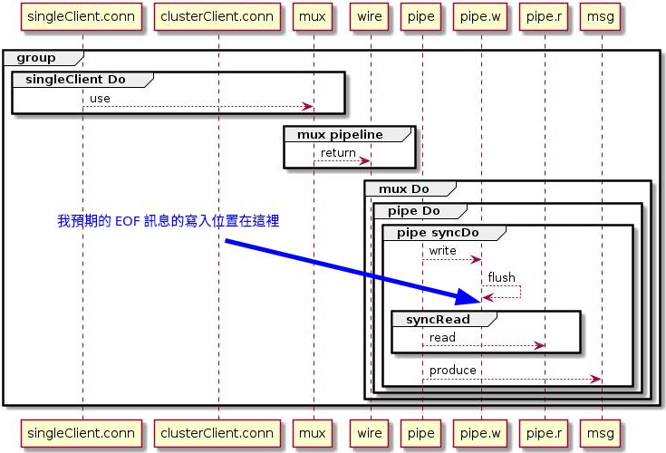 

### 解答

可能你有什麼誤會，應該沒有 EOF 要寫入

### 問題

我一開始還覺得奇怪，把 mockClient.Close() 註解起來，整個程式永遠不會停止，進行互相等待的死結，後來想想這是合理的因為要告知 Pipe 沒有更多的資料要傳了，執行 Close() 函式時，(應該同時也傳入 EOF)

我是想要請教您，這方面的問題，您是如何處理的？

如果防止 mockClient 和 mockServer 互相等待的死結？

沒有告知對方EOF的訊息，程式不會停的

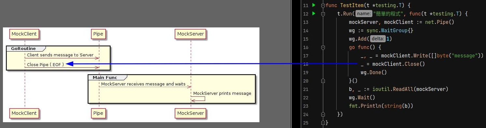 

### 解答

喔，原來你說是 Go 的 io.EOF，這只是 Golang 用來表示一個 read stream 已經讀完了的訊息。

而一個 tcp stream 什麼時候才會讀完？就是讀到對方送給你的 FIN 包的時候，這時候 Golang 會返回 io.EOF 給你。

而你用的 io.ReadAll 的行為就是要把整個 stream 讀完，也就是讀到 io.EOF 才結束。

在 Redis client 中 tcp stream 是重複使用的，不會用 io.ReadAll 來讀取

## 2022年3月2日

### 問題

我這樣理解，您看對不對？

如果要在圖上找 pipe 物件的位置，我認為pipe 類實現 wire 接口，wire 接口可以讀寫 client side cache，因為這接口有 DoCache 函式再上一層的 conn 接口可以重置連線，因為這接口有 Overwrite 函式最後 mux 類為所有功能的大集合，就把它當成主要的控制端Client 接口為用戶介面，Client 接口馬上直接連接到 mux 控制端，就可以控制整個程式了這樣子理解對嗎？謝謝

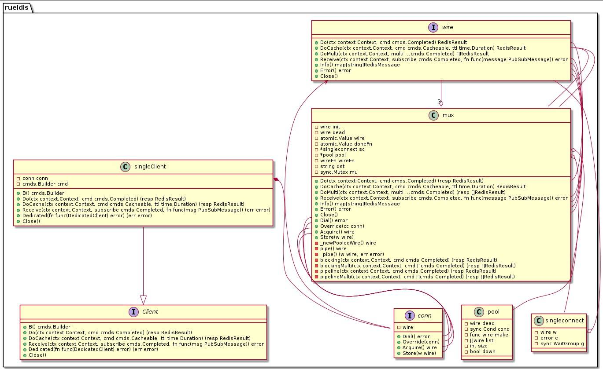

### 解答

是的，大致上就是這樣。我的區分方式是 pipe 負責一個 tcp connection。mux 則是負責多個 pipe。 

## 2022年3月17日

### 問題

請教您有關 Cache 的問題，我是覺得看您的程式碼，每看一次會有不同的啟發當 Linked List 用在 Cache 時，我是覺得 hit 數量最多的資料會往前移動但為何在下圖中，反而是往後移動？謝謝

 

這是另一個版本的 Cache，是往前移動的，和您的程式碼不同

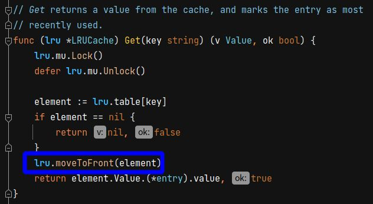 

### 解答

單純只是我選擇 list 後面放要留比較久的。要改成放前面也是可以

### 回應

了解，謝謝您，後來再去看程式碼，發現程式清除數據是從頭開始清除了，所以往後移動數據就可以留久一點

 

## 2022年3月24日

### 問題

這是一個比較沒有變化的 LRU cache 的組件圖

您的 cache 很有趣，變化比較多，之後再畫成另一張組件圖作比較

想請教您，兩個問題

1 您的 cache 有使用 channel 作等待，cache 已經有 sync.RWMutex 多讀單寫的上鎖，

再加一個 channel 做更進一步的控制，讓有些讀取可以進行必要的等待，

我是覺得很有趣，我這樣理解正確嗎？

2 moveThreshold 臨界值的用途為？我是想不透

謝謝

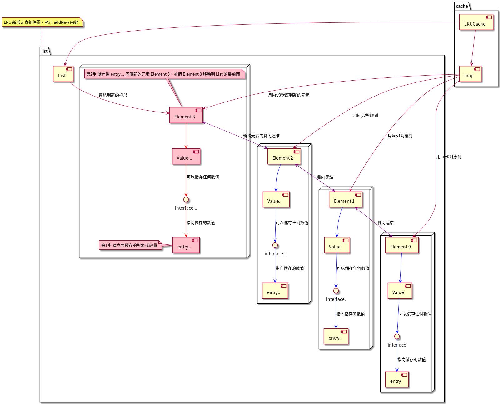

補上程式碼的圖片

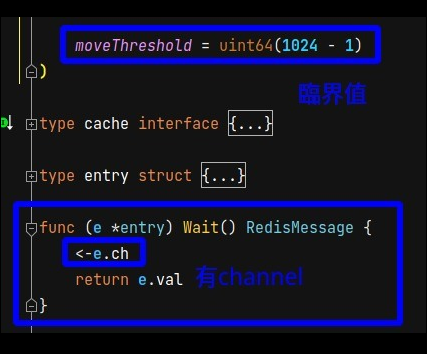 

### 解答

1. 對，RWMutex 是為了取出 entry。取出後 entry 本身就用 channel 做 singleflight
2. moveThreshold 只是為了增加使用 RLock 的機會而已

### 回應

關於 single flight 的部份我還要在更仔細的看程式碼了，看看能不能再學習到更多技巧。

後來我再去查，程式不會把 "快取的擊中次數" 重置為零

代表只是單純想讓 "擊中次數超過臨界值的資料" 將更有機會留在快取裡。

謝謝您的引導和解答

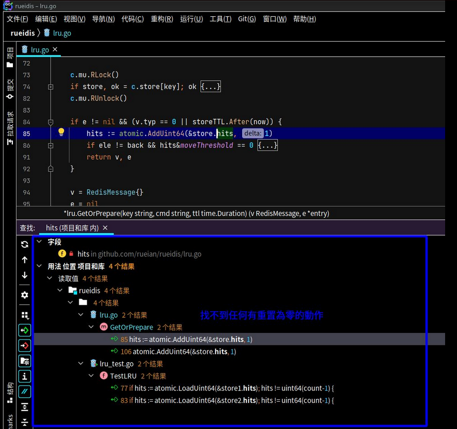 

## 2022年3月31日

### 問題

我想您說的 Single Flight 和 LRU 快取的關係如下圖

很多 pipe 會執行，但是大多數 pipe 會等待，因為 channel 沒訊號送來，所以會先等待，為下圖的 "Single Flight 的被通知方" 的部份

少數的 pipe ，會更新 cache 和 利用 channel 去通知其他 pipe 快取已更新了，大家可以去讀資料了，為下圖的 "Single Flight 的主動通知方" 的部份

我覺得這張圖還不是很清楚，有錯誤請指正，謝謝

另外我在聽到有人在 meetup 問在本地的快取，如何克服 GC 效能的問題？您在提到一些專案，請問 這些專案的 github 在那？謝謝您

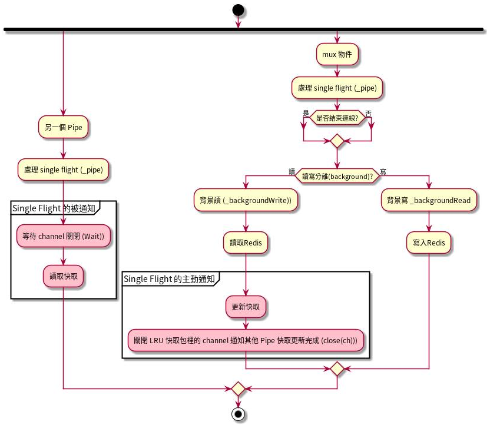 

### 解答

我是這樣想：

當使用者用 DoCache() 的時候，先查找 LRU Cache。如果 Cache Miss 的話，會在 Cache 中創建一個 singleflight placeholder，同時也會往下層 pipe 送 redis request。當 response 回來的時候就可以更新 placeholder 並通知其他在等待的 goroutine。

我在 Meetup 中提到的是 bigcache 跟 fastcache：

https://github.com/VictoriaMetrics/fastcache

https://github.com/allegro/bigcache

## 2022年4月7日

### 問題

我也把您上星期所說的改正如下圖，並用紫色來標記

也找到您提到 cache missing 的部份，但還是看不懂，請教您一下，關於這段程式碼
} else if entry != nil {return newResult(entry.Wait(), nil)

我對這小段程式碼的理解為 當 LRU cache 有資料，再進行 single fligt 的等待

我想請教的是，LRU cache 都己經有資料了，為何還要等待，就直接回傳不就好了？

謝謝您

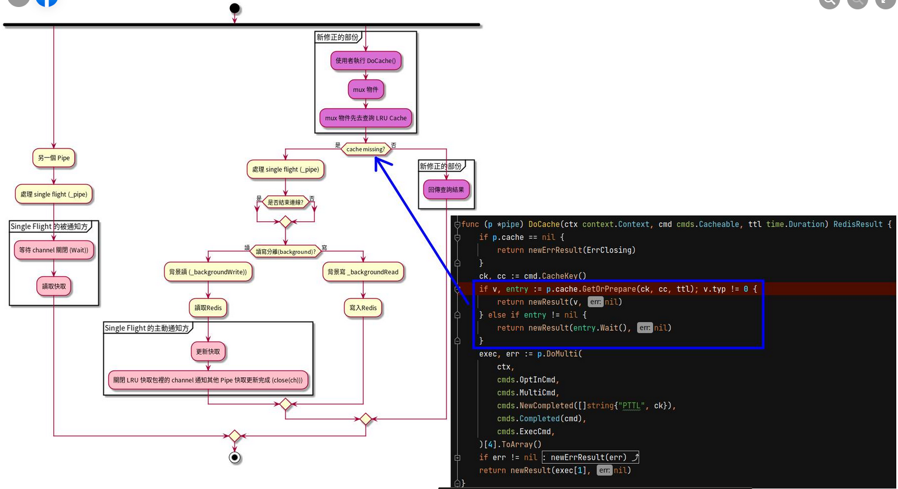

### 解答

第一個分支的 v.typ != 0 才是真的 cache hit

那個 entry 就是之前提到的 singleflight placeholder，有拿到這個 placeholder 的就要等待

沒拿到 placeholder 的就創建一個並且往下走真的發出 request

## 2022年4月14日

### 問題

我發現之前 Sigle Flight 運作圖，我畫的錯誤太多了，所以大修改

先直接說我認為的結論，您 Single Flight 做兩次，但是這兩次的 Single Flight 不同

第一次的 Single Flight 是在建立和 Redis 的連線

第二次的 Single Flight 才是真的去跟 Redis 進行查詢

雖然程式會先去查詢 LRU 快取，但是和 Redis 的連線會先準備好

您所說的 Place Holder 就是為了要做 Single Flight 的關鍵，所以 LRU 快取才要做 Channel 進行等待

如圖中所示

wire := m.pipe() 為建立連線

resp := wire.DoCache(ctx, cmd, ttl) 為向 LRU Cache 查詢

而 wire := m.pipe() 在 resp := wire.DoCache(ctx, cmd, ttl) 的前面

從這裡可以知道和 Redis 的連線會先準備好

如果還有錯誤請指正，謝謝您

另外，能否提示一下，之前請教的問題，PutOne 函式不能被 PutMulti 取代的原因為何？
謝謝

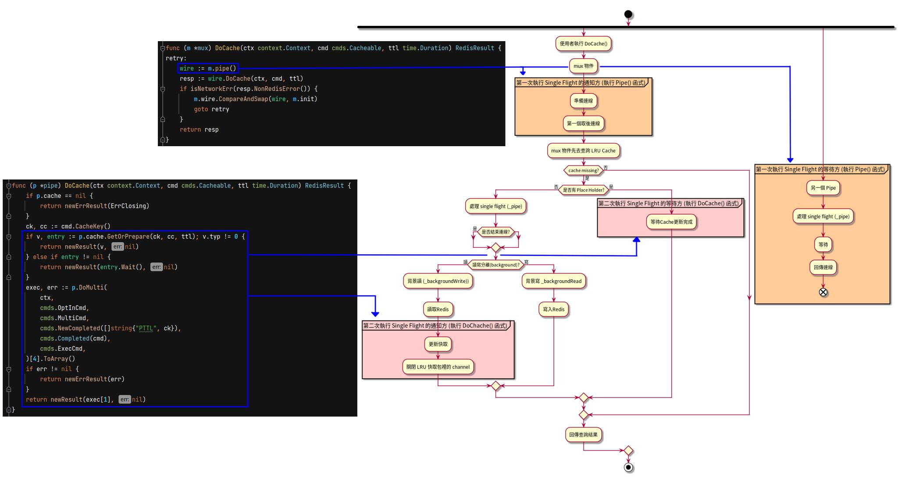

附上修正的運作圖

橘色的區塊為第一次的 Single Flight，主要是先準備和 Redis 的連線

紅色的區塊為第二次的 Single Flight，會對 Redis 進行查詢

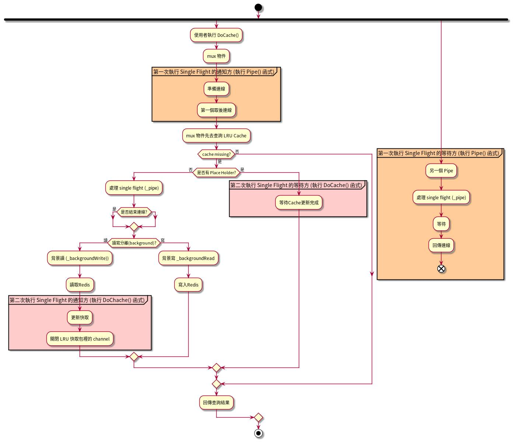

### 解答

- 由 mux 去查找 cache 應該是不太對，Cache 是在pipe 物件內部的，圖上改成由 pipe 負責比較接近實際的程式碼
- 是可以被 PutMulti 取代的，只是我覺得分開會對 GC 的影響比較小

## 2022年4月21日

### 問題

我參考之前畫的類圖，把活動圖進行修正，改成
* 產生 mux 物件，pipe 物件實現 wire 接口
* pipe 物件先去查詢 LRU Cache


另外我想請教，您上星期提到，考量的 GC 問題是否為以下內容？

```go
type queue interface {
    PutOne(m cmds.Completed) chan RedisResult
    PutMulti(m []cmds.Completed) chan RedisResult
    NextWriteCmd() (cmds.Completed, []cmds.Completed, chan RedisResult)
    NextResultCh() (cmds.Completed, []cmds.Completed, chan RedisResult, *sync.Cond)
}
```

在 PutMulti(m []cmds.Completed) chan RedisResult 這一行
[]cmds.Completed 為切片內含指標，cmds.Completed 資料內有指標資料，如下

```go
type Completed struct {
    cs *CommandSlice
    cf uint16
    ks uint16
}
```

切片內含指標會給 GC 造成壓力，我以前有想過這問題，後來想想，覺得問題可能不大

因為如果切片內含指標，到時程式會想辨法限制切片的大小，避免 GC 壓力過大

我是覺得，如果把 PutOne 合拼並拼入 PutMulti，雖然會有參數 []cmds.Completed 為 切片內含指標，但是切片大小為1，資料量太小，對於 GC 壓力應不大

我是比較支持 PutOne 拼入 PutMulti，還是您有其他的考量？謝謝

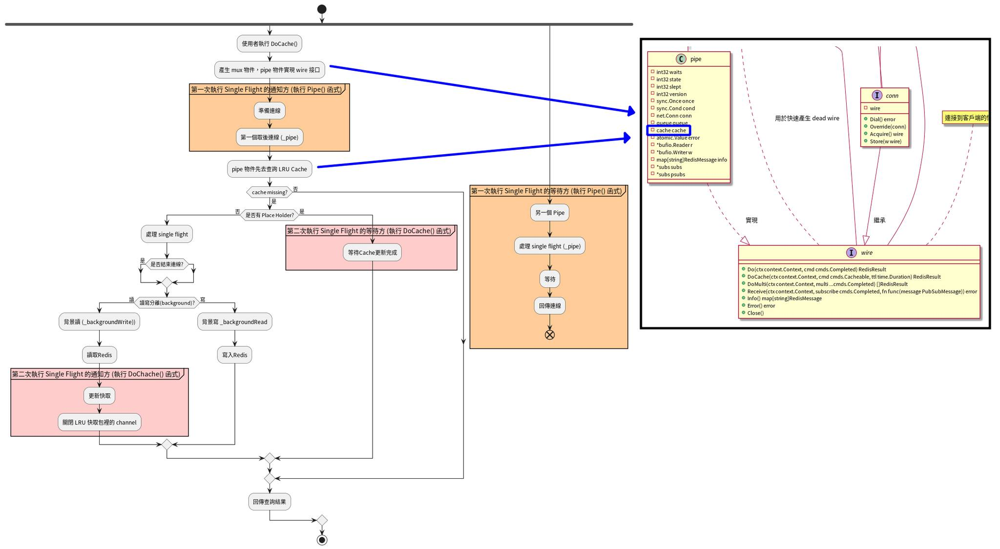

### 解答

是沒其他考量了，我想這邊還需要再研究一下。
如果對 GC 沒影響，那合併起來是最好，code 會更簡單一些。但有影響的話我覺得分開還是值得的。

## 2022年4月28日

### 問題

以前在看您的程式，會很明顯看到會先執行 Build 函式，一開始會看不太懂

比如

c.Do(ctx, c.B().Set().Key("key").Value("val").Nx().Build()).Error() 中
B() 函式為 Build 函式

之後再把類圖繼續往下畫，圖中紅色部份為最新新增的部份。

queue 接口會使用 Completed 物件做為參數。

而 Completed 物件是由 Arbitrary 物件 提供的方法產生出來的。

Arbitrary 物件會使用 sync.Pool 去提升效能，減少產生和回收物件的動作，減少 GC 的壓力。

所以我認為，會常看到 B() 函式進行 Build 的動作，原因是在於為了要提升程式性能，減少 GC 壓力，不知道這樣的說法是否正確？

另外請教一個問題，在程式碼檔案裡 rueidis/internal/cmds/gen.go ，有一行 Code generated DO NOT EDIT。

這代表整個程式碼是自動產生的，但是在 gen.go 旁沒有看到自動產生程式的腳本，不太清楚這些程式碼是怎麼來的？

也不太清楚 gen.go 的程式碼和 整個專案 rueidis 是如何連接的？

謝謝

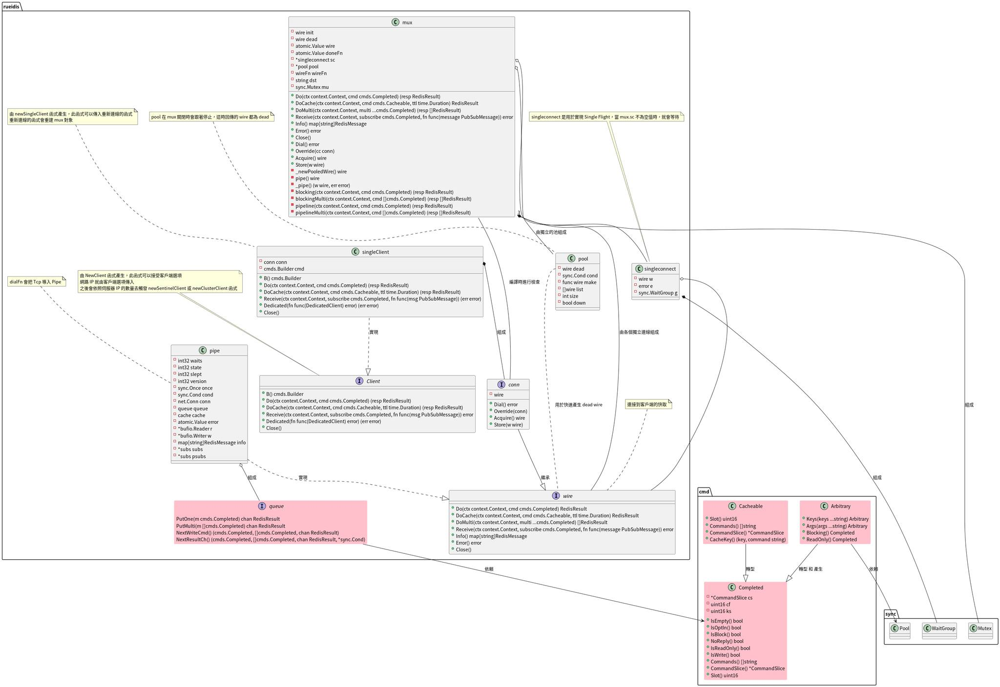

### 解答

B() 是 command builder 的入口，呼叫後就會從 Pool 中取出 []string 準備塞入 command 用，的確是為了減少 GC。
internal/cmds/gen.go 是由 /hack/cmds/gen.go 生出來的

## 2022年5月5日

### 問題

我閱讀了 rueidis/hack/cmds/gen.go 程式碼後，這裡所產生的程式碼 應為最後要傳送到 redis 指令的地方

看到這份自動產生程式碼的程式，第一個直覺在想兩個問題，想要請教您
1 這是否為 AST 節點？
2 在 hack 資料夾裡是在想要突破什麼效能議題？

( 題外話，我目前參與的專案的廣度和深度都比較大，把專案當課本
同一個專案，用到很多技巧，其中一個技巧就是 AST 節點
也有 hack 資料夾，hack 資夾內可能是處理效能的相關議題，我一直覺得 Go 語言是有難度的
所以難免我會有這些聯想 )

關於第一點，您的 rueidis/hack/cmds/gen.go 程式碼，我覺得有點像 Ast 節點，但好像又少了一些東西，

像 Ast 節點的原因為有樹狀結構產生，比如 AclDeluser 的子結點為 AclDeluserUsername
但是結點的類型從頭到尾只有一種類型為
type node struct {
Parent *node
Child *node
Next *node
Cmd command
Arg argument
Root bool
}

如果是 AST 結點的話，應會有各種不同類型的節點可以進行操作
可能您也認為這不是 AST 節點，所以沒有把 package 名種命名為 ast

第二點，放在 hack 資料夾的程式可能會和效能有關，可能您一直在處理 GC 的效能議題，所以才把程式碼放在 hack 資料夾內

之後，自動產生的程式碼也和 sync.Pool 連接在一起
我對 AST 節點不熟，如果觀念錯誤，麻煩指正了，謝謝

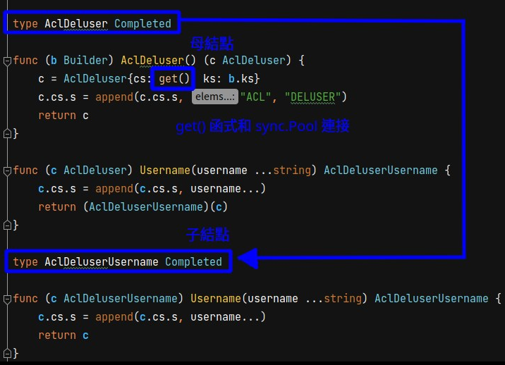 

### 解答

這段程式碼跟 AST 還有效能都無關，它也不在 rueidis 裡面運行。

它單純是個 code generator 用來生產 rueidis 的 command builder

## 2022年5月12日

### 問題

請教您一個問題，如果 gen.go 的程式碼用遞迴函式去處理，您覺得適合嗎？

```go
package main

import "fmt"

// 主程式
func main() {
	// 產生 demo 節點物件
	node := generateDemoNode()
	Build(node)
}

func Build(node *node) {
	node.Accept()
}

// 節點
type node struct {
	FullName string
	Parent   *node
	Child    []*node
}

func (n *node) Accept() (*node, bool) {
	v := visitor{}
	newNode, skipChildren := v.Enter(n)
	if skipChildren {
		return v.Leave(newNode)
	}

	for _, next := range n.Child {
		next.Accept()
	}

	return v.Leave(newNode)
}

// 參考者
type visitor struct {
	parent *node
}

func (v *visitor) Enter(in *node) (*node, bool) {
	for i := 0; i < len(in.Child); i++ {
		in.Child[i].Parent = in
	}
	fmt.Println("type " + in.FullName + " Completed")

	return in, false
}

func (v *visitor) Leave(in *node) (*node, bool) {
	if in != nil {
		if in.Parent != nil {
			fmt.Println(in.Parent.FullName + " -> " + in.FullName)
		}
		return in, false
	}

	return in, true
}

// 產生 demo 節點物件
func generateDemoNode() *node {
	setUserNode := &node{
		FullName: "AclSetuser",
		Parent:   nil,
		Child:    nil,
	}

	setRuleNode := &node{
		FullName: "AclSetuserRule",
		Parent:   nil,
		Child:    nil,
	}

	setUserNameNode := &node{
		FullName: "AclSetuserUsername",
		Parent:   nil,
		Child:    nil,
	}

	a := &node{FullName: "A"}
	b := &node{FullName: "B"}
	c := &node{FullName: "C"}
	setUserNode.Child = append(setUserNode.Child, setUserNameNode, a, b, c)
	setUserNameNode.Child = append(setUserNameNode.Child, setRuleNode)

	return setUserNode
}
```

後來我看了程式碼，覺得或許可以用 AST 遞迴函式去處理

有時會常看到 AST 遞迴函式，卡西哥就貼過一次

我看過二次了，AST 遞迴函式會有三個地方可以控制，彈性我覺得很夠，分別為

進入節點的 Enter 函式

中間處理函式 Accept 函式

離開節點的 Leave 函式

方向也很有彈性，可以由 Parent 節點進入 Child 節點去操作，也可以反向，由 Child 節點進入 Parent 節點

另外，如果是產生程式碼的程式，最後一定會有吐檔動作，產生程式碼

但是 AST 遞迴函式 可以把吐檔工作都分配到各個節點，每個節點會有寫檔動作

程式的執行結果
type AclSetuser Completed
type AclSetuserUsername Completed
type AclSetuserRule Completed
AclSetuserUsername -> AclSetuserRule
AclSetuser -> AclSetuserUsername
type A Completed
AclSetuser -> A
type B Completed
AclSetuser -> B
type C Completed
AclSetuser -> C
(意思為 AclSetuser 物件會有方法產生 AclSetuserUsername 物件
而 AclSetuserUsername 物件 也會有方法產生 AclSetuserRule 物件)

AST 遞迴函式對於個性比較保守的人會比較喜歡使用，因為程式碼彈性很高

而且它有自動補齊節點資料的功能，當我發現節點參數不足時，就在 Enter 進入函式時，就開始去修正或補齊節點資料

那請問如果用這方法去寫 gen.go，您覺得可能會遇到什麼問題？謝謝

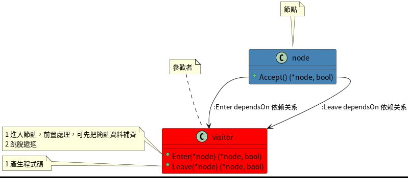 

## 2022年5月19日

### 問題

之後有考慮要使用 single flight，看您操作兩次後來有想，為何 single flight 不跟 sync cond 一起使用？

所以自己就來試試看，好像可行，程式碼如下[https://go.dev/play/p/eV490rghJor](https://go.dev/play/p/eV490rghJor?fbclid=IwAR39To0eb7c0x_lhKQtnbuqUMehMeY-ZIX00gWB3uxn5udNZhFHsEXRnTyI)請教一下，如果我這樣做，會有什麼問題？

```go
package main

import (
	"fmt"
	"log"
	"sync"
	"sync/atomic"
	"time"
)

type demo struct {
	status atomic.Value
	cond   *sync.Cond
}

var done = false

type demoFunc func(string)

func (d *demo) NewDemo() demoFunc {
	var returnfunc demoFunc
	if d.status.Load().(int) != 0 {
		if d.cond != nil {
			returnfunc = d.read
		}
	}
	if d.status.Load().(int) == 0 {
		d.status.Store(1)
		d.cond = sync.NewCond(&sync.Mutex{})
		returnfunc = d.write
	}
	return returnfunc
}

func (d *demo) read(name string) {
	d.cond.L.Lock()
	for !done {
		fmt.Println(name, "waits")
		d.cond.Wait()
	}
	log.Println(name, "starts reading")
	d.cond.L.Unlock()
}

func (d *demo) write(name string) {
	log.Println(name, "starts writing")
	d.cond.L.Lock()
	done = true
	d.cond.L.Unlock()
	log.Println(name, "wakes all")
	d.cond.Broadcast()
}

func main() {
	demo := &demo{}
	demo.status.Store(0)

	array := [5]string{"A", "B", "C", "D", "E"}

	for i := 0; i < len(array); i++ {
		go func(i int) {
			demo.NewDemo()(array[i])
		}(i)
	}

	time.Sleep(time.Second * 3)
}
```

### 解答

你的 NewDemo() 裡面會有 race

atomic.Value 沒辦法這樣當作 Lock 用除此之外，用 sync cond 只要知道到 Wait() 離開前會自動呼叫 L.Lock() 就沒問題了

## 2022年5月26日

### 問題

您上次提到我程式有 race 的問題，您說的沒錯，是有這個問題如下圖所示，如果紅色區塊為蛋殼的話，上週程式蛋殼有縫，會被協程衝破

改良的程式碼如下[https://go.dev/play/p/bqbPzdMM3kz](https://go.dev/play/p/bqbPzdMM3kz?fbclid=IwAR2VgqKTK-TKKp8z47_ji3LIfGUxjn8g_yd5WRLpQ-vzyoi95CI4j6ueIvM)

```go
package main

import (
	"fmt"
	"log"
	"sync"
	"sync/atomic"
	"time"
)

type demo struct {
	cond   *sync.Cond
	status int32
	count  uint64
}

var done = false

type demoFunc func(string)

func (d *demo) NewDemo() demoFunc {
	atomic.AddUint64(&d.count, 1)
	var returnfunc demoFunc
LOOP:
	exchange := atomic.CompareAndSwapInt32(&d.status, 0, 1)
	if exchange == false {
		if d.cond != nil {
			returnfunc = d.read
		}
		if d.count == 1 {
			goto LOOP
		}
	}
	if exchange == true {
		returnfunc = d.write
	}
	return returnfunc
}

func (d *demo) read(name string) {
	d.cond.L.Lock()
	for !done {
		fmt.Println(name, "waits")
		d.cond.Wait()
	}
	log.Println(name, "starts reading")
	d.cond.L.Unlock()
}

func (d *demo) write(name string) {
	log.Println(name, "starts writing")
	d.cond.L.Lock()
	done = true
	d.cond.L.Unlock()
	log.Println(name, "wakes all")
	d.cond.Broadcast()
}

func main() {
	demo := &demo{}
	demo.cond = sync.NewCond(&sync.Mutex{})

	array := [7]string{"A", "B", "C", "D", "E", "F", "G"}

	for i := 0; i < len(array); i++ {
		go func(i int) {
			demo.NewDemo()(array[i])
		}(i)
	}

	time.Sleep(time.Second * 3)
}
```

改良的方式就是把蛋殼的縫補起來，二行程式碼合成一行

改良效果也不錯，我覺得這個 Single Flight 比較好讀，效能也不錯

請教您一個問題，這個版本的 Slight Flight 和您版本的 Slight Flight 那個比較好？

還有這個 Slight Flight 您覺得還有那些漏洞，謝謝您

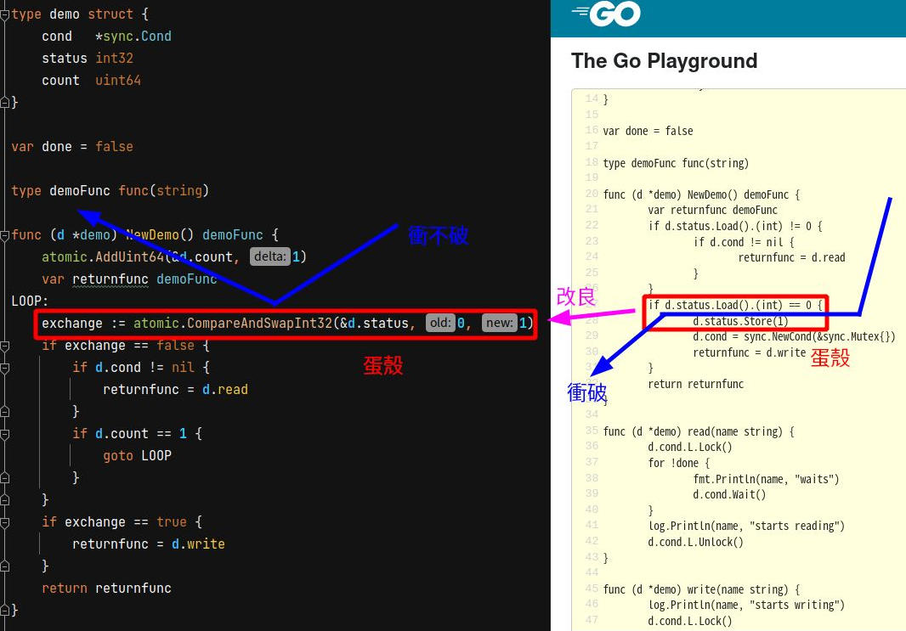

這是執行結果，多個協程程式再執行過程中，只有部份協程等待，所以我才會比較喜歡這個版本的 Single Flight

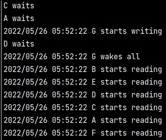 

目前基準測試也壓的過去，上週程式直接 panic

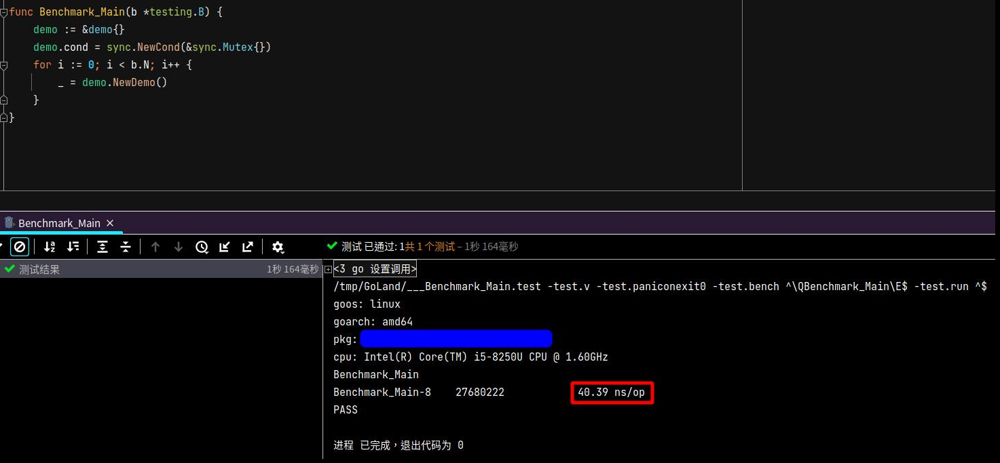

### 解答

30 行的 d.count 要用 atomic load31 行的 busy wait 最好避免，而且看起來有可能無窮迴圈singleflight 的 cond Locker 可以試試看 RWMutex

## 2022年6月2日

### 測試中

後來才發現用 sync 包可以寫三個 single flight 版本，版本1 為接近您的版本，我覺得您的版本比較好

版本3 是我新寫的版本，光想到版本3 的上鎖，我就預期效能會很不好，光聽您提到用 RWMutex 我就知道問題出在那裡

版本1 使用 sync wait group ，程式碼如下

```go
package main

import (
	"fmt"
	"log"
	"sync"
	"sync/atomic"
	"time"
)

type demo struct {
	wait   sync.WaitGroup
	status int32
	done   bool
	value  int
}

type demoFunc func(string)

func (d *demo) NewDemo() demoFunc {
	if exchange := atomic.CompareAndSwapInt32(&d.status, 0, 1); exchange == true {
		return d.write
	}
	return d.read
}

func (d *demo) read(name string) {
	if !d.done {
		fmt.Println(name, "waits")
		d.wait.Wait()
	}
	log.Println(name, "starts reading with lock", d.value)
}

func (d *demo) write(name string) {
	log.Println(name, "starts writing")
	d.value = 1
	d.done = true
	log.Println(name, "wakes all", d.value)
	d.wait.Done()
}

func main() {
	demo := &demo{}
	demo.wait.Add(1)

	array := [26]string{"A", "B", "C", "D", "E", "F", "G", "H", "I", "J", "K", "L", "M", "N", "O", "P", "Q", "R", "S", "T", "U", "V", "W", "X", "Y", "Z"}

	for i := 0; i < len(array); i++ {
		go func(i int) {
			demo.NewDemo()(array[i])
		}(i)
	}

	time.Sleep(time.Second * 3)
}

```

版本2 使用 sync rwmutex ，程式碼如下

````go
package main

import (
	"fmt"
	"log"
	"sync"
	"sync/atomic"
	"time"
)

type demo struct {
	rwLock sync.RWMutex
	status int32
	done   bool
	value  int
}

type demoFunc func(string)

func (d *demo) NewDemo() demoFunc {
	if exchange := atomic.CompareAndSwapInt32(&d.status, 0, 1); exchange == true {
		return d.write
	}
	return d.read
}

func (d *demo) read(name string) {
	d.rwLock.RLock()
	if !d.done {
		fmt.Println(name, "waits")
	}
	log.Println(name, "starts reading with lock", d.value)
	d.rwLock.RLock()
}

func (d *demo) write(name string) {
	log.Println(name, "starts writing")
	// d.rwLock.Lock()
	d.value = 1
	d.done = true
	log.Println(name, "wakes all")
	d.rwLock.Unlock()
}

func main() {
	demo := &demo{}
	demo.rwLock = sync.RWMutex{}
	demo.rwLock.Lock()

	array := [26]string{"A", "B", "C", "D", "E", "F", "G", "H", "I", "J", "K", "L", "M", "N", "O", "P", "Q", "R", "S", "T", "U", "V", "W", "X", "Y", "Z"}

	for i := 0; i < len(array); i++ {
		go func(i int) {
			demo.NewDemo()(array[i])
		}(i)
	}

	time.Sleep(time.Second * 3)
}
````

版本3 使用 sync cond ，程式碼如下

```go
package main

import (
	"fmt"
	"log"
	"sync"
	"sync/atomic"
	"time"
)

type demo struct {
	cond   *sync.Cond
	status int32
	done   bool
	value  int
}

type demoFunc func(string)

func (d *demo) NewDemo() demoFunc {
	if exchange := atomic.CompareAndSwapInt32(&d.status, 0, 1); exchange == true {
		return d.write
	}
	return d.read
}

func (d *demo) read(name string) {
	switch d.done {
	case true:
		log.Println(name, "starts reading without lock", d.value)
	case false:
		d.cond.L.Lock()
		for !d.done {
			fmt.Println(name, "waits")
			d.cond.Wait()
		}
		log.Println(name, "starts reading with lock", d.value)
		d.cond.L.Unlock()
	}
}

func (d *demo) write(name string) {
	log.Println(name, "starts writing")
	d.cond.L.Lock()
	d.value = 1
	d.done = true
	d.cond.L.Unlock()
	log.Println(name, "wakes all")
	d.cond.Broadcast()
}

func main() {
	demo := &demo{}
	demo.cond = sync.NewCond(&sync.Mutex{})

	array := [26]string{"A", "B", "C", "D", "E", "F", "G", "H", "I", "J", "K", "L", "M", "N", "O", "P", "Q", "R", "S", "T", "U", "V", "W", "X", "Y", "Z"}

	for i := 0; i < len(array); i++ {
		go func(i int) {
			demo.NewDemo()(array[i])
		}(i)
	}

	time.Sleep(time.Second * 3)
}
```

這三組程式會送去做基準測試，會把 runlevel 下降去壓測，去除作業系統圖形介面干擾，不過我預期版本3效能不會太好，測了就知道

做測試時，程式碼還要在小修改，慢慢把協程數量一直加大去壓測三組程式

## 2022年6月9日

我用三個 single flight 版本去進行基準測試測試環境為 

Linux 核心版本為 4.19.0-16-amd64，無 GUI 介面

Go 版本為 1.18.3

CPU 為 Intel i5-8250U ( 8 ) @ 3.400GHz

Memory 為 31870MiB

測試結果為waitGroup 版本效能最好，也是 rueidis 的版本，這符合預期，因為能少上鎖就少上鎖cond 版本效能為次好，也是我的餿主意，這不符合預期，因為我預期這版本跑出來的數據會很慘，結果表現還能看

rwMux 版本效能為最不好，這也不符合預期，沒想到是三組數據最不好的

進行測試時，程式要改寫，如下

waitGroup 版本

```go
package main

import (
	"fmt"
	"sync"
	"sync/atomic"
)

var total = 1000

var count sync.WaitGroup

type demo struct {
	wait   sync.WaitGroup
	status int32
	done   bool
	value  int
}

type demoFunc func(int)

func (d *demo) NewDemo() demoFunc {
	if exchange := atomic.CompareAndSwapInt32(&d.status, 0, 1); exchange == true {
		return d.write
	}
	return d.read
}

func (d *demo) read(num int) {
	if !d.done {
		d.wait.Wait()
	}
	if d.value != 1 {
		panic("error" + fmt.Sprintln(d.value))
	}
	count.Done()
}

func (d *demo) write(num int) {
	d.value = 1
	d.done = true
	d.wait.Done()
	count.Done()
}

func main() {
	count.Add(total)

	demo := &demo{}
	demo.wait.Add(1)

	for i := 0; i < total; i++ {
		go func(i int) {
			demo.NewDemo()(i)
		}(i)
	}

	count.Wait()
}

// >>>>> >>>>> >>>>> >>>>> >>>>>

/*
package main

import (
	"testing"
)

func Benchmark_Main(b *testing.B) {
	for i := 0; i < b.N; i++ {
		count.Add(total)

		demo := &demo{}
		demo.wait.Add(1)

		for i := 0; i < total; i++ {
			go func(i int) {
				demo.NewDemo()(i)
			}(i)
		}

		count.Wait()
	}
}
*/
```

rwMux 版本

```go
package main

import (
	"fmt"
	"sync"
	"sync/atomic"
)

var total = 1000

var count sync.WaitGroup

type demo struct {
	rwLock sync.RWMutex
	status int32
	done   bool
	value  int
}

type demoFunc func(int)

func (d *demo) NewDemo() demoFunc {
	if exchange := atomic.CompareAndSwapInt32(&d.status, 0, 1); exchange == true {
		return d.write
	}
	return d.read
}

func (d *demo) read(num int) {
	d.rwLock.RLock()
	if d.value != 1 {
		panic("error" + fmt.Sprintln(d.value))
	}
	d.rwLock.RLock()
	count.Done()
}

func (d *demo) write(num int) {
	d.value = 1
	d.done = true
	d.rwLock.Unlock()
	count.Done()
}

func main() {
	count.Add(total)

	demo := &demo{}
	demo.rwLock = sync.RWMutex{}
	demo.rwLock.Lock()

	for i := 0; i < total; i++ {
		go func(i int) {
			demo.NewDemo()(i)
		}(i)
	}

	count.Wait()
}

// >>>>> >>>>> >>>>> >>>>> >>>>> 

/*
package main

import (
	"sync"
	"testing"
)

func Benchmark_Main(b *testing.B) {
	for i := 0; i < b.N; i++ {
		count.Add(total)

		demo := &demo{}
		demo.rwLock = sync.RWMutex{}
		demo.rwLock.Lock()

		for i := 0; i < total; i++ {
			go func(i int) {
				demo.NewDemo()(i)
			}(i)
		}

		count.Wait()
	}
}
*/
```

cond 版本

```go
package main

import (
	"fmt"
	"sync"
	"sync/atomic"
)

var total = 1000

var count sync.WaitGroup

type demo struct {
	cond   *sync.Cond
	status int32
	done   bool
	value  int
}

type demoFunc func(int)

func (d *demo) NewDemo() demoFunc {
	if exchange := atomic.CompareAndSwapInt32(&d.status, 0, 1); exchange == true {
		return d.write
	}
	return d.read
}

func (d *demo) read(num int) {
	switch d.done {
	case true:
		if d.value != 1 {
			panic("error" + fmt.Sprintln(d.value))
		}
		count.Done()
	case false:
		d.cond.L.Lock()
		for !d.done {
			d.cond.Wait()
		}
		if d.value != 1 {
			panic("error" + fmt.Sprintln(d.value))
		}
		d.cond.L.Unlock()
		count.Done()
	}
}

func (d *demo) write(num int) {
	d.cond.L.Lock()
	d.value = 1
	d.done = true
	d.cond.L.Unlock()
	d.cond.Broadcast()
	count.Done()
}

/*
func main() {
	count.Add(total)

	demo := &demo{}
	demo.cond = sync.NewCond(&sync.Mutex{})

	for i := 0; i < total; i++ {
		go func(i int) {
			demo.NewDemo()(i)
		}(i)
	}

	count.Wait()
}
*/
```

結果我是覺得不合預期，您覺得呢？

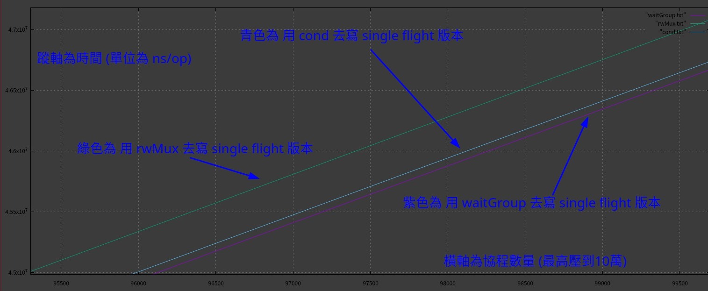

### 解答

waitGroup 版本中第 30 行讀取 d.done 是會 race 的，要直接 d.wait.Wait()

單純用 rwMux 的版本因為可能很久才會輪到 write goroutine 執行，所以比較不好應該是合理

cond 版本第 30 行讀取 d.done 一樣是會 race 的。你可以把 d.cond.L.Lock() 底下接到 rwMux.RLock

## 2022年6月16日和23日

1 這次跑基準測試，比上星期小心了，注意機器的散熱，不然數據會跳動

2 要測 write 協程何時結束工作，只要修改二行程式碼，當 write 協程結束工作時，主程式也就跟著結束工作，是可以測出

3 我是用上鎖的程度去判斷那一個版本的效能最好，我認為上鎖的程度為 cond 版本 \> RWMux 版本 > waitGroup 版本，上愈少鎖效能愈好，我預期 RWMux 版本效能應不是最差的

最後上星期您說

單純用 rwMux 的版本因為可能很久才會輪到 write goroutine 執行，所以比較不好應該是合理

根據基準測試的結果，協程數量為 100000，和您說的相符合，不過我不是很了解原因，您能說明更多細節嗎？謝謝


我假設以下原因會有這些現象，您看看有沒有道理？

問題一，數據為何會跳動？

假設一：和機器散熱有關，每次執行基準測試時，要先停15秒，等機器散熱完畢

假設二：和調度器 scheduler 有關，要看調度器何時把 write 協調排進 queue 裡，還是一開始就被處理掉了

問題二，數據為何 cond 的效能會比 rwMux 還要好？

假設：因為 cond 底層的 lock 可以用 mutex 或 rwMux 去實作，而我的例子是用 mutex

所以先直接比較 mutex 和 rwMux 的性能就可以

在 write 協程很早完成工作時，mutex 效能會比 rwMux 好

在 write 協程很晚很晚才完成工作時，rwMux 效能會比 mutex 好

因為 mutex 的 lock 可以用 channel 去模擬

如果 write 協程很早完成工作時，channel 就被關閉了，這時 所有 read 協程得知 channel 關閉時，就很快的結束工作，這時效能會很好

### 解答

建議要先把上次程式中的 race 修掉再重新測試一下

### 回應

好的,謝謝您的建議,我再仔細檢查,不過能通過十萬協程的壓測,也有可能不是 race ，不然早就 panic 了,反正我再仔細檢查,謝謝您

## 2022年6月30日

### 測試中

您說的沒錯，第三十行的 d.done 是 race

用 golang 的 race 偵測去檢查，這是 race

我有另一個觀點，如果就算這一行發生 race，也沒有關係

因為 d.done 預設值為 false，所以 !d.done 的值預設為 true

所以這整段來看，預設就是進行等待

```go
if !d.done {
	d.wait.Wait()
}
```

當 race 發生時，d.done 突然被改成 true，但這一段讀取 d.done 的值為 false，這個值是錯的，沒有差，因為協程還是在等待的狀態

也就是這個原因，golang 的 race 偵測指出程式有問題，但是去跑基準測試時反而沒有問題

這是因為 golang 的 race 偵測只檢查 d.done 是不是同時寫入讀取，但是它不管整個程式邏輯

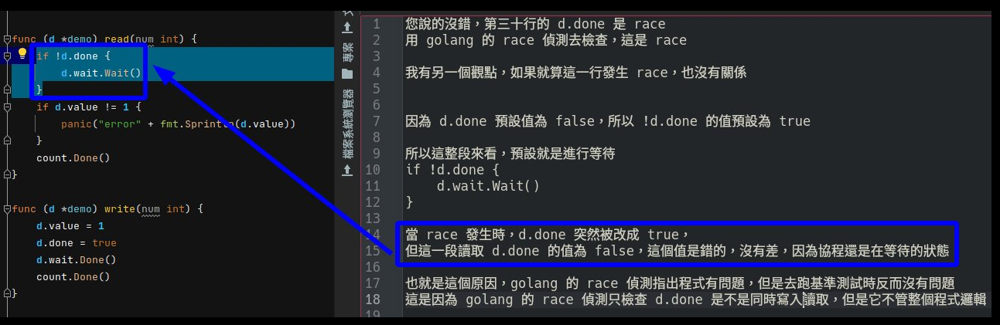

再來，這次實驗其實有個盲點，在跑測試時會有一個問題，編譯器會進行優化，編譯器在優化時，會影響實驗數據所以執行基準測試時，不只機器溫度要控制，連編譯器優化的功能也要關閉，因為這些都會影響跑出來的數據

以這次例子來說，編譯器有沒有進行優化我還不知道，我就急著幫整個程式進行優化，

```go
if !d.done {
  d.wait.Wait()
}
```

這一段其實是我為了性能考量所寫的，因為能減少等待就減少等待，但是這會影響跑出來的數據

總而言之，我同意您的說法，第三十行的 d.done 要去掉，為了數據的客觀性，謝謝

## 2022年7月7日

### 問題

1 謝謝您，您說的是對的，當把所有 第 30 行讀取 d.done 都移除後，cond 的版本效能會下降

就跟一開始預期的結果一樣，wait 效能 > rwmux > cond

2 前一個版本效能會不符合預期是因為我都在用 第 30 行讀取 d.done 去躲開上鎖

3 最後結論是能像 wait 版本都不上鎖的話，效能是最好的，其他的話就要看寫法了，有的寫法是 rwmux 效能較好，有的寫法是 cond 效能較好

4 前一個版本就算有 race ，結果也是正確的，因為只要答案是錯的，程式會直接 panicif d.value != 1 {    panic("error" + fmt.Sprintln(d.value))}

5 圖中的數據結果單位為 ns/op

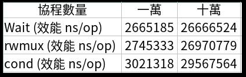 

### 解答

可以看一下文件中的 Incorrect synchronization 範例 [https://tip.golang.org/ref/mem](https://tip.golang.org/ref/mem?fbclid=IwAR2jbGDfSNp4kfSvDA5qTOIYL1R1V0UWp4BQFkxp45Dv7cRRAiLwi9I4wQE)

## 2022年7月14日

### 問題

您上次建議這篇 [https://tip.golang.org/ref/mem](https://tip.golang.org/ref/mem?fbclid=IwAR0m_yDdfr96p-b3y4O3PxXFiSqidDxQmbNbWPIgQF5gDwVfmoLa75hvf0A)，我閱讀之後覺得很震驚

以圖中的例子，一開始來看，覺得並不是 race ，但是事實上，這程式不安全我覺得主要的原因是編譯器可能會重編，改變順序

在複雜的例子，可能編後的結果 done = true 會比 a = "hello, world" 先執行完成

有人會問，為何有人會要寫程式會有 race ？

這是因為要用 race 去反而增加一些效能比如有五個協程，如果有二個較不重要的協程，不限制 race ，效能反而會上升

但是看了這篇文章，我覺得用 race 換效能的行為太危險了，因為編譯器的行為是我無法掌握的

所以以後，只要 race 偵測測出問題，就判定程式是錯誤的，最後，謝謝您，您說的是對的

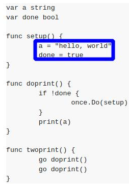 

文章用的是 observe 這個字，我要去確認背後的含意我再想想有沒有什麼例子，編譯後，done = true 會比 a = "hello world" 先執行完成

您認為是什麼原因呢？謝謝您

### 解答

大部分都跟 CPU 各別架構有關，[https://en.wikipedia.org/wiki/Memory_ordering](https://en.wikipedia.org/wiki/Memory_ordering?fbclid=IwAR3ob-YcpzXn_E0SQt8G0cFcBLlnPz4YIug9LLYd06s93wPikjB0CwbmRZE)，軟體需要依賴在硬體提供的 Memory Ordering Guarantee 才能正確運行

### 問題

我查一些資料， Golang 提供的 channel 、 lock 和 atomic 可以維持程式執行順序

那不就是除了 channel 、 lock 和 atomic 之外，程式執行的順序是不能被保證的

不過關於 atomic 的 Memory Ordering Guarantee 是比較爭議的，我再去查資料

### 解答

就在同一份文件有說明喔 [https://tip.golang.org/ref/mem#atomic](https://l.facebook.com/l.php?u=https%3A%2F%2Ftip.golang.org%2Fref%2Fmem%3Ffbclid%3DIwAR3NxbuWJYxcHEkAH9jayMkEUCS7JyhuZX8eIMNW4c7WG0bhMXkhNvs9NNo%23atomic&h=AT089Q-3qjHPlLhc_Z9EXakzIhMPzq_xTv-segUsVS0-z-PfOgxzKSlcCjOgEJkreSUUOPA1mrK9_j5aSaSyxbM8j12BSFR9vdtRRBC6MWynmWHAHRI7LR9tknx9&__tn__=R]-R&c[0]=AT2fqQ2c4b-uAD5AumtDfS4fDuvHobpacjX8v4_9r0UQs_ndGk4bOsLnerOpJMFWlPz82UW6xnlsUPL4DEijVojwJjk3kujWp5VC5ravnux8leMZRjRyjge2o24nrP7m9523JQpR7zBvKiU041PpQ23SVJ7RgNoOg5XBCsL11jZxOgBcx2WgZC7BDam-azpmbqTtvSi-P-2RQqN9HU-H-AMQdDFpDz8xdFimXFgcMw8JjJ2zxRCIFXiV)

### 問題

了解，謝謝，今天 atomic 保證 Memory Ordering，應該是硬體支援，萬一有一些硬體架構不支援？不知道我想我是沒差，我都是用老古董電腦

## 2022年7月21日

### 問題

我有看到程式內有 slots 陣列，會記錄 redis cluster 16384 個 slots 分佈，

shouldRefreshRetry 函式會去更新 slots 陣列，當更新完成後，程式就知道最新的 slots 分佈，就可以對 redis cluster 進行操作，之後就可以用一行 DoCache 函式執行結束

請教一下，為何後面還要再用 switch 進行處理，還要分 RedirectMove RedirectAsk RedirectRetry 三個不同的 cases？ (黃色標示的地方)

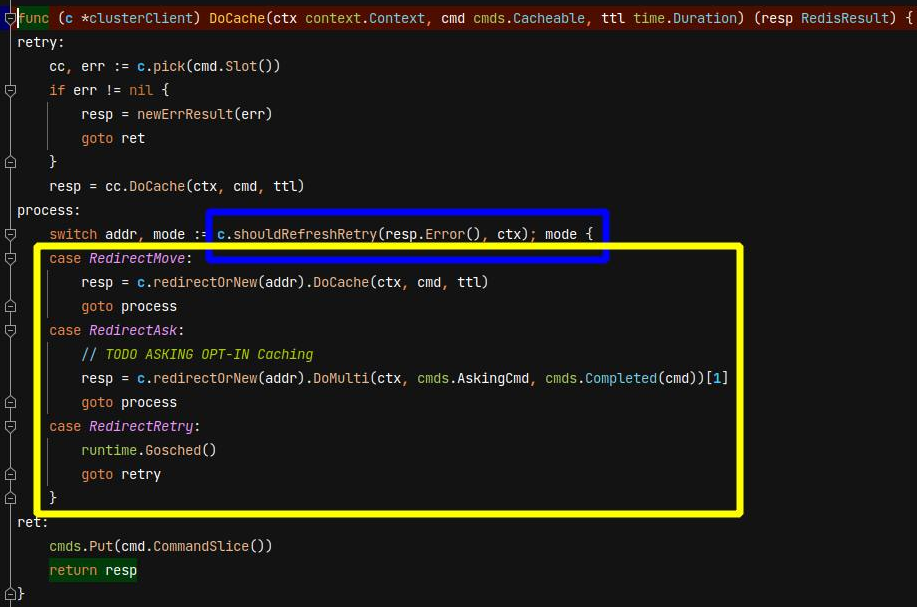

### 解答

https://redis.io/docs/reference/cluster-spec/#redirection-and-resharding

### 問題

其實把上星期的模型和您所建議的官方文件進行對照，我是這樣想的

第一個公式 Pi+1 = pi (1-1/n) ^ n(1-pi) 這個公式是用來 Push，是用來隨意傳播病毒

第二個公式 pi+1 = pi * pi 這個公式是用來 Pull，是故意到中毒人的面前去感染病毒

為何我認為第二個公式是故意的，因為在正常的速度下，收斂不會這麼快，除非故意

原本，實作的人，是要用 tcp 去實作第二個公式，用 udp 去實作第一個公式

但是實作的人後來發現，udp 也可以用來存放 gossip session 的資料，竟然心跳要做，就順便連 gossip 資料一起傳出去

但是 udp 是用來隨意傳播病毒，不是故意讓別人中毒，很難逼近第二個公式的收斂速度，那就一次傳三個封包出去，去增加傳播的速度，這樣就能接近第二個公式

官方文件有說 redis 的 gossip 資料有放在 udp 的封包裡

有時知道理論，就可以明白什麼事可以做，什麼事不能做，但是有時會愈讀愈不明白，後來我就想這個推理去解釋

那請教您，您認為 redis gossip 協定，是要用 udp ？ 還是 tcp ？ 還是兩個都用 ？ 去進行實作比較好，謝謝

### 回答

Gossip 跟 UDP/TCP 沒有什麼關聯的，用哪個都可以

### 問題

(1) 我看了您提供的文件的前半段，了解到會有 RedirectMove 和 RedirectAsk 的這兩個 case，主要是因為 redis 的 slot 要進行遷移

(2-1) 而 RedirectMove 的 case 是指該 key 跟著 slot 遷移到新結點完成，資料在最終目的節點

(2-2) 而 RedirectAsk 的 case 是指該 key 在遷移到新節點中，目前資料在原來的舊節點

(3-1) redis 只允許 slot 資料在同一個節點，那不就是維持 CAP 中的一致性 Consistency (資料只有一份，當然一致)

(3-2) 官方文件有說不能保證 redis cluster 資料不會遺失，那可用性也沒了 Availability (官網用節點故障重啟為例)

(3-3) 分區容錯性也沒有啊，slot 資料只在一個結點 (資料只有一份，那裡來的分區容錯性)

(4) 了解程式碼後，發覺整個 CAP 只剩下一個 Consistency，那做叢集的目的並不是在備份資料，看起來只是為了提高承載量

(5) 請教一下，把 Redis 在遷移 Slot 的動作，解釋成在維持 CAP 的一致性，我是不知道這說法對不對？謝謝

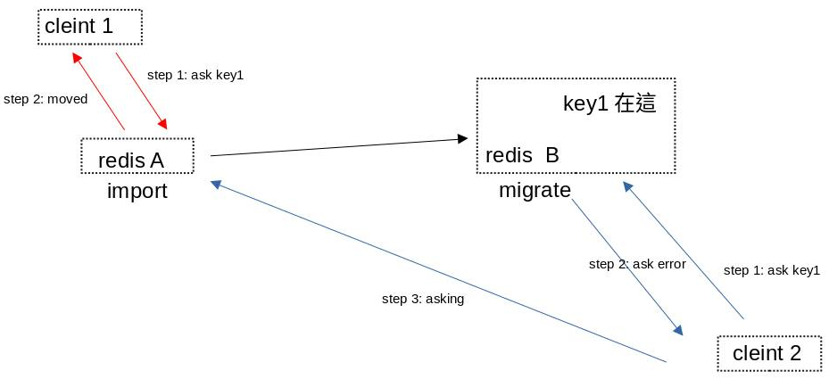

## 2022年8月4日

### 問題

我為了了解 Redis 的叢集，把整個 Redis Cluster 的封包倒出來看

(1) Redis Cluser 是基於 udp 和 tcp，我先過濾 udp 封包，只剩 tcp 的封包

(2) 但是會發現一個很不正常的現在，節點之間會不停的用 tcp 去進行連線，問題是節點的資料都已經收斂了，一直用 tcp 連線不是在浪費連線

這現象不是很合理？

(3) 直接去查 Gossip 協定的模型，有提供兩個公式，全部是以病毒傳播進行理解

(4) 第一個公式 Pi+1 = pi (1-1/n) ^ n(1-pi)，是指在病毒傳播下的存活率

有多少次方代表有多少人 n(1-p) 中毒，成為傳播者

(1-1/n) 為和人接觸的機率，除了自己以外

p1 為現在的存活率

整個公式看起來很合理，這是真實世界的公式，這公式允計病毒傳播可以失誤，而且收斂速度慢很多

和大家想像的病毒傳播速度差很多，因為這個公式是以 RT 值為1 時，去進行計算模型應以這個公式訂為下界

(5) 第二個公式 pi+1 = pi * pi ，這個公式我不能理解，但可以在紙上計算，這個公式收斂的速度很快

有可能是作者想像中的病毒傳播的存活機率公式

上一個公式病毒還可以傳播失敗，要達到這個公式的收斂速度，病毒傳播不能失敗但現實的狀況是不可能，因為可以對方早就中毒了

(6) 當初在實作 gossip 協定的人，並無法達到第二個公式的收斂速度，那怎麼辨？就用大量的連線去接進第二個公式

所以今天或者是未來，Redis Cluser 一定會有節點數的限制，很難在突破，如果要突破，就是跟模型進行挑戰

(7) 請教您有沒有什麼方法可以擴展節點數，而且能維持一樣的收斂速度？我是偏向不挑戰模型，謝謝

## 2022年8月18日

### 問題

Redis Cluster 的 Gossip 協定做的很精簡，因為 Redis 不能跨區跨分區，最好 Cluster 就在一個區網內，不然我找不到合理的解釋了

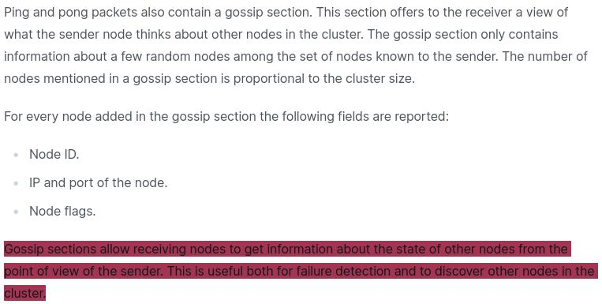 

[參考文件](https://l.facebook.com/l.php?u=http%3A%2F%2Fbitsavers.trailing-edge.com%2Fpdf%2Fxerox%2Fparc%2FtechReports%2FCSL-89-1_Epidemic_Algorithms_for_Replicated_Database_Maintenance.pdf%3Ffbclid%3DIwAR1QfLQPOEYalvpKlYDs5_tX6RlU6iQnLWKe8WbfotXejF4iDawEfzRsf1w&h=AT3WA3i2fsNPHtw0pkJaziojdDr7_53nsbGMlpDx_2FezIFcGQnf83fe-cn8AtC2VoU9baomcp4BA2EpqtYlkqgkr7yNscMteu38E7virWMw8cl3gCxgaFYbLc2c&__tn__=R]-R&c[0]=AT2PH43SMmfg_cya5iCMIKM4Gki_BKm9Td1jIBZtes8YOGknnDRtoeoSZMYUJdPheF5zXgZsQx-lSsOh7sZFY9hmmt0juQNqdB9Rsq8wGUcHndXXvDFoNmDAxuamuCS-QOZ44miRQ0jRpWH4j6HKr-NUlKQfsed16PFNZQ_YMfPqRTXVXBfg3RK2R8trGq_DcauFIvWcLSF4mXj_lQGyvIKrKkMNFse3zTjSqc0iremXbG9evaYD)

Gossip 協定有二種模式，一為用 tcp 去實現 Anti-entropy，用 udp 去實現 Rumor，今天 Redis 的文件沒特別說明 Anti-entropy ，Rumor 又做在心跳裡，Redis 的 Gossip 機制太精簡了

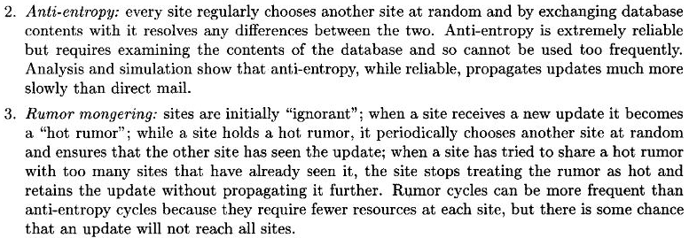 

我的之前的假設應該算是合理的

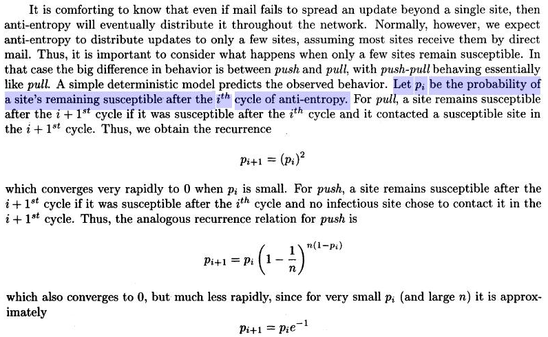 

## 2022年8月25日

### 問題

在官方文件有提到

Cluster current epochRedis Cluster uses a concept similar to the Raft algorithm "term". In Redis  Cluster the term is called epoch instead, and it is used in order to  give incremental versioning to events. When multiple nodes provide  conflicting information, it becomes possible for another node to  understand which state is the most up to date.

主從模式要哨兵，主從模式就是使用共識演算法

叢集也是用共識演算法的觀念，但不用哨兵

同樣都是共識演算法，一個要哨兵，另一個不要，想不透，您覺得呢？謝謝

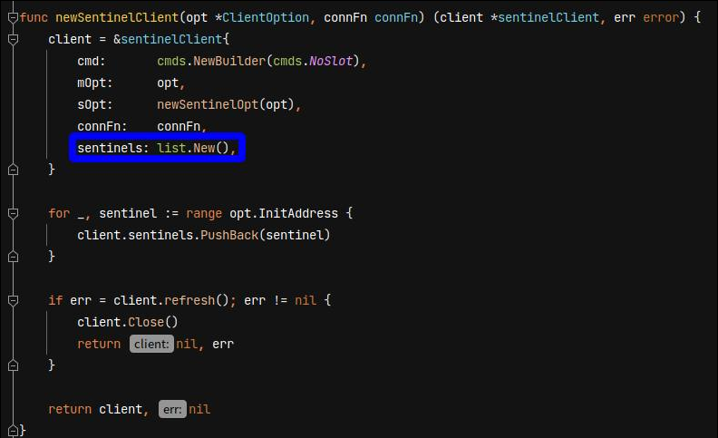

在 slave 變成 master 過程中為何要為 master 同意？應是要 slave，因為 slave 之間才知道誰的資料是最新的不過從這裡，我是覺得哨兵不是必要的

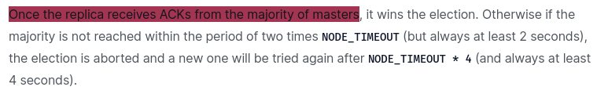 

### 解答

有些使用者不希望資料分散在不同 redis instances 上面而選擇用哨兵模式

## 2022年9月1日

這句話提到，slave 升級時，要由 master 同意，這不是代表在 cluster 裡，一個 master 只能配一個 slave

如果今天 master 壞了，slave 準備要升級成 master，但只有單台 slave ，這台 slave 沒有同伴，所以只能跟多台 master 確認

如果在 cluster 中，一台 master 有多台 slave ，可能就是災難的開始，只是懷疑，不清楚？

謝謝


### 解答

建議的配置是一個 master 至少要有兩個 slave

## 2022年9月1日

### 問題

其實有花一些時間去找 redis 的模型，redis 的演算法源頭是 Paxos 演算法，有些人可能會認為找模型沒有必要，但是未來電費可能會愈來愈貴，也要在停電時找一些事來做

以下是我所認為的 Paxos 模型，說不定再不久就能找到 redis 的模型了

理論上來說，整個模型都達到共識值 n 時，就再也不會接受值 v 了，所以共識值 w 也不存在

實務上來說，acceptor 只能接受一個建議編號，萬一用 go routine 惡意突破時，整個模型也只接受之前的共識 n

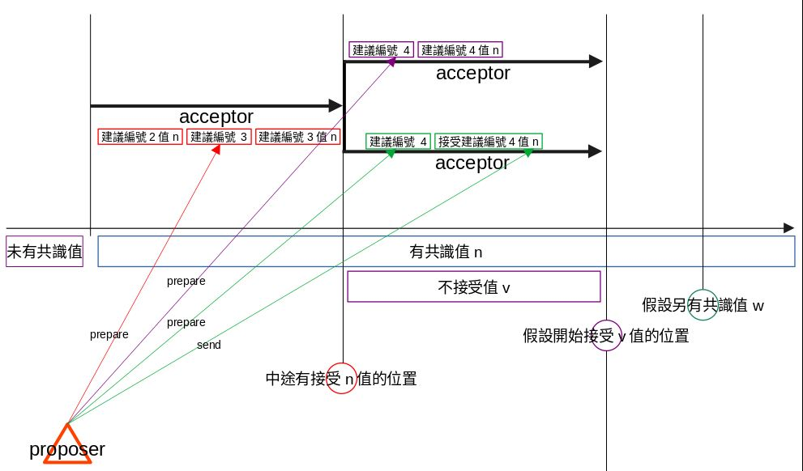 

## 2022年9月8日

### 問題

[http://www.cs.toronto.edu/....../handouts/paxos-proof.pdf](http://www.cs.toronto.edu/~samvas/teaching/2415/handouts/paxos-proof.pdf?fbclid=IwAR27KQhYVFmU21sqm7aKMSl7SV-Nt3h7lRj5nUhd6iTuNYIBdl8R3vW7JSI)

其實這是多倫多大學對於共識演算法證明，我也不能全抄，所以加上自己的見解

我再做一個假設，哨兵大部份會放在 slave 結點上，我懷疑

Sentinel 的共識演算法是做在 slave

Cluster 的共識演算法是做在 master

### 解答

sentinel 是獨立於 redis 的另外一組 cluster，一般是沒放在 slave 節點上

## 2022年9月8日

### 問題

您說的是對的，我思考上有兩個誤區

第一、我沒考量到 client commit 的狀況，比如 client 有 5 筆最新資料，master 有 6 筆，slave1 有 7 筆，slave2 有 12 筆，這二台 slave 都可以成為 master，當 fail over 時

第二、slave 要變成 master 的條件並不是那一台的 slave 資料最多，而是那一台 slave 沒有缺少己經到 client commit 的資料

第三、而且當多台 slave 裡，愈多數量的 slave 符合資格變成 master ，就會愈安全，fail over 的速度也愈快

第四、也就是這個原因，slave 變成 master ，redis 希望可以快速除錯，只要符合資格的 slave 經由其他 master 同意時，就可以升級成 master

第五、redis 有些地方設計的很漂亮，邏輯應該是這樣，我之前的誤區很大

最後、謝謝

## 2022年9月15日

### 問題

請教您一個問題，您使用 cluster 的機會是不是比 sentinel 多？很少會用到 sentinel，我是覺得大家大部份都會以 cluster 為主

因為主要的原因，在這麼多台的 slave ，不知道要讀那台 slave ，才會能到較及時的更新訊息，最後有時還不是都要去跟 master 讀取資料

到頭來都都無法完全減輕 master 的負載，而且我看您的程式碼大部份是向 master 讀取

另外 sentinel 無法擴展，就代表無法進入雲端，sentinel 能夠運用的場景不多了

謝謝

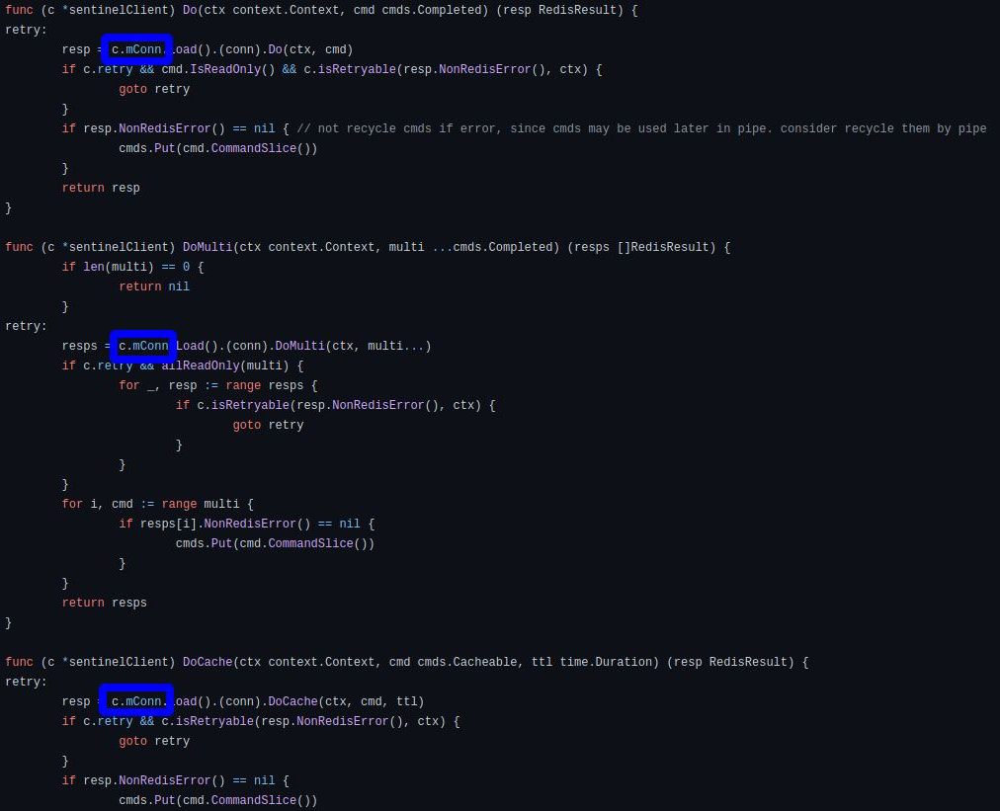

### 解答

是的，建議用 cluster 比較好，除非使用者不希望資料被分散。

## 2022年9月15日

### 問題

我打算做一件事，就是以後程式的每個包，都會放入一個 Makefile，這個 Makefile 會執行多個檢查機制，包含單元測試、基準測試、race 偵測 和 goroutine leak 偵測

我是有看到您使用 uber 的 goroutine leak 偵測，我是不打算用，因為沒有數據回報

原在函式內的 goroutine 在函式結束後，不一定會馬上消失，要有一個程式去偵測何時消失，比如下圖中的 Convergence 為 -1，是指 goroutine 一直有殘留

Convergence 可以定為下一次測試的依據，Convergence 縮短時，就代表程式的性能提升了

這程式就去跟 go 的 runtime 要資料，自己寫一寫就好了，目前並不打算去用 uber 的

那您認為 uber 的 goroutine leak 偵測好用嗎？有時看到 uber 的東西，會有一種好像有缺東缺西的感覺，謝謝

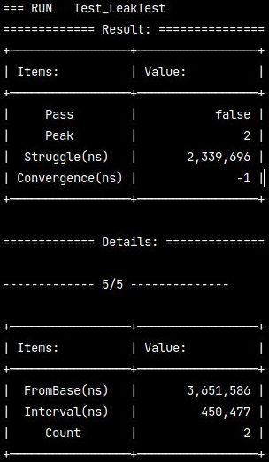 

### 解答

我覺得不錯，它幫我找出很多 bug

### 問題

uber 的 goroutine leak 我是用過，最後還是加在 makefile 裡，但是 uber 是加在 teat 裡面，我還是想寫一個加在 benchmark 裡，

因為如果加在 benchmark 裡，我就可以這樣描述當執行速度 0.5955 ns/op,執行 1000000000 次後, goroutine leak 將在 700 ms 消散

這可以用在較基礎的包的測試，只是為了讓程式可以描述的更清楚，您會不會覺得我這個餿主意不錯吧？

### 解答

多一點資訊總是好的，不過 700ms 是怎麼測量的？會不會不準確呢？

### 問題

這可以用來測基礎的重要包，比如 ticker ，ticker 一個是官方版，另一個是 atomic 版，我之前會覺得奇怪，有一位老程序員，年紀真的很大，為何 ticker 要自己寫一個 atomic 版

如果是用 uber 的 go routine leak 就只能知道都通過，但不知道那個方法較佳，後來發現用 atomic 版寫出的 ticker 性能不但比較好，而且 go routine 的消散速度也較快

測量的方法為每一微秒時去觀察去跟 runtime 要資料，去觀察 go routine 的變化，一微秒這個數字也可以去看狀況去調整

準確的問題，700ms 是很小的程式才會到達這數字，我目前的使用狀況，

以 ticker 來說，跑起來都很難看，一個 20000 亳秒，另一個  1500，要考慮準確的問題的話，我可能要優先把這二個測試結果壓下來，再來提高測試的準確性，至少目前由測試可以得知，用 atomic ticker 是一個提升效能的好方法，不過能精確測量當然更好

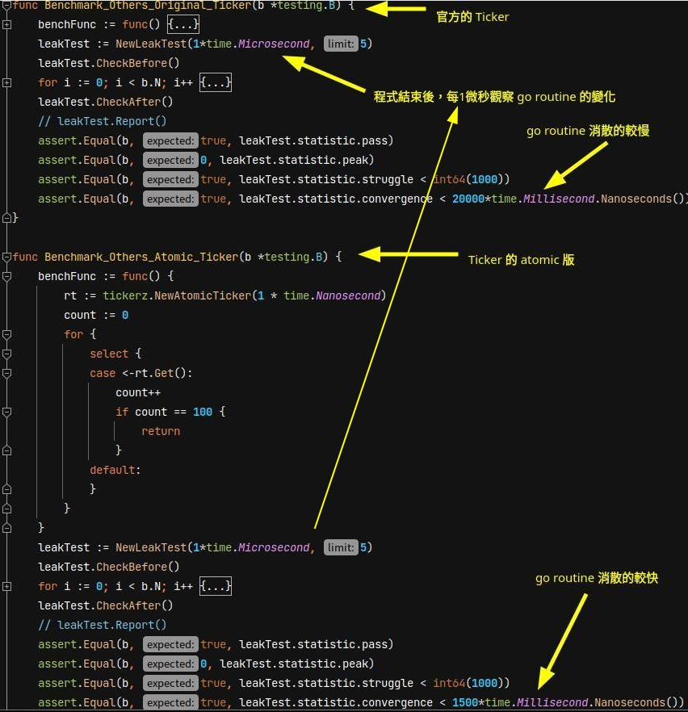

我還在想跑出的數據為何會這麼大，到 20000 亳秒，這是因為我是從程式一執行時就開始計時了，這代表 20000 亳秒 包含執行時間，如果要提高精確度，就調量測的時間間隔就好，比如 1 微秒改成 500 奈秒

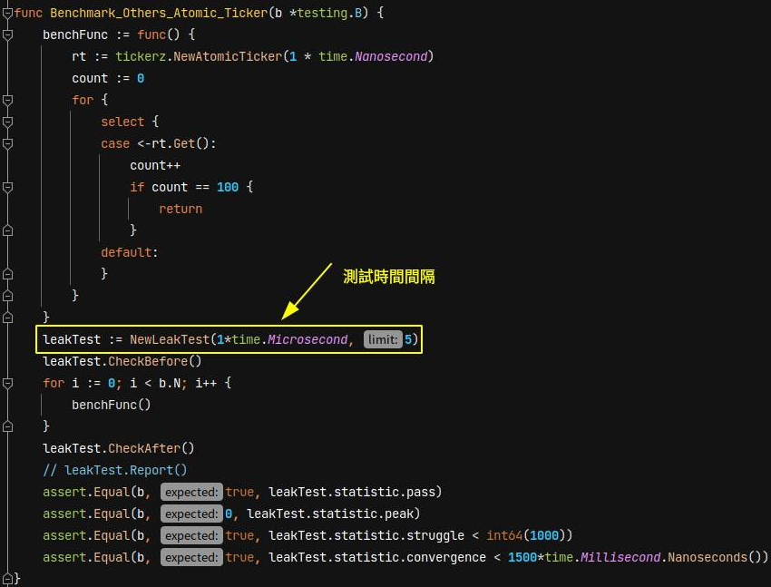

我跟您說實話，我程式 gc 有點嚴重，所以數據要正確的話，我要去處理 gc 的問題，不要讓 gc 去影響測出來的秒數

但是因為被 gc 干擾，所以測出來的數據為高估值比如 go routine 是 700 ms 消散，但是實際上可能是在 685 ms 就消散了

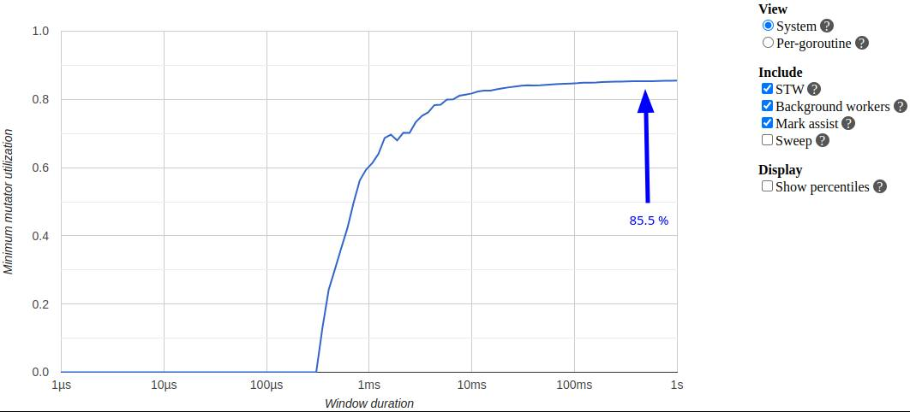

## 2022年10月6日

### 問題

當我第看到您的專案，我有一個感覺，技巧用的很多而且密度很高，這對我來說是好機會，我可以從中參考，看看有什麼技巧我也可以學起來使用

請教您一個問題，我再看記錄時，在 rueidiscompat 包裡，發現您有做一個 adapter，但是做出來後，沒有大量使用？不清楚目的為何？

rueidiscompat 中的 compat 應是指相容的意思，但還不是很清楚？

謝謝

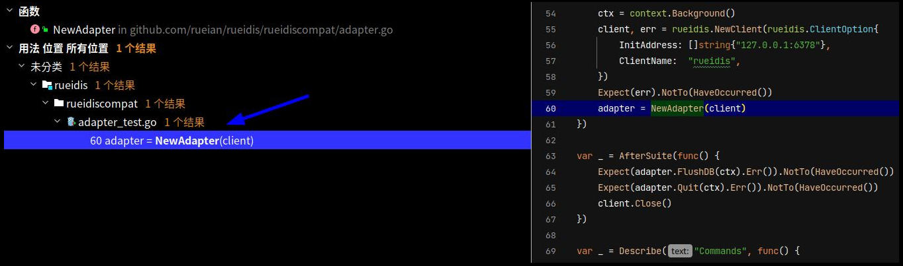 

### 解答

是的，rueidiscompat 是由 418Coffee 貢獻的，讓人可以更容易得從 go-redis 轉到 rueidis [https://github.com/rueian/rueidis......](https://github.com/rueian/rueidis?fbclid=IwAR2yaqb9p-H_8QOrKxjK1VwkxQKjbk9_woo32gDYUJi59iDfzLF5KMCfc-Y#high-level-go-redis-like-api)

## 2022年10月13日

### 問題

請教是什麼原因，會讓您減少 goroutine 的數量？藍色的地方如果用 i = 0，看起來合理，為何要改成 1？謝謝

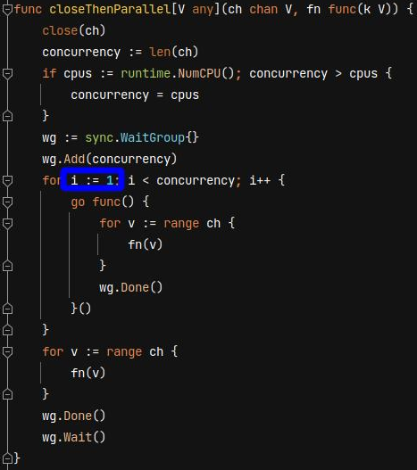 

### 解答

如果 len(ch) == 1 就不想多開 goroutine 了

### 問題

GoRoutine 的數量和效能的關係應為協程之間等待的時間愈長，所需要的 GoRoutine 數量就愈多，您有使用 single flight ，這代表協程之間是有等待的時間，所以需要增加 GoRoutine 數量去提升效能

以下圖真實數據為例，橫軸為等待的微秒數，縱軸為 GoRoutine 的數量，成穩定的線性成長

當然因為 CPU 的核心為固定的，不可能永遠穩定的線性成長，一定會有它的極限

程式可能有可以利用增加 GoRoutine 數量去提升效能的地方，可能在其他地方吧，想了一個星期要如何去估計 GoRoutine 的數量

 

其實我在猶豫，這裡雖然只有時只有一個 channel，但是 GoRoutine 的數量要和等待時間成正比

程式有使用 single flight 就會產生等待時間，我是覺得可以把 GoRoutine 的數量增加

我在仔細想想好了，寫程式時，我也會遇到這個問題，謝謝您

### 問題

(1) 如果一直依造 go routine 的數量要根據 go routine 的等待時間而定的話，您提到的 len(ch) == 1 那附近有一層 go routine ，single flight 又有一層，這樣形成雙層 go routine  (雙層 go routine 會減少 go routine 之間的等待時間，因為在短時間內急著製造 go routine)，這時 go  routine 的數量稍微下降，就可以獲得較好的性能

(2) 您提到 len(ch) == 1 就不想多開 goroutine，如果不能由多開 goroutine 提升效能的話，我覺得是好事，因為這樣代表 sigle flight 裡的 go routines 之間等待時間很短

(3) 我只是提一下我所認為較合理估計開 go routine 數量的方法，您覺得這合理嗎？之前，看大家討論，有些說很難估，但我想還是要找辨法估出來，不然寫程式會茫茫然的

測試程式在這

``````go
package main

import (
	"sync"
	"testing"
	"time"
)

func Benchmark_GoRoutineLimit(b *testing.B) {
	chanA := make(chan int, 10000)
	chanB := make(chan int, 10000)

	for i := 0; i < 10000; i++ {
		chanA <- i
	}

	count := 160
	for i := 0; i < b.N; i++ {
		wg := sync.WaitGroup{}
		wg.Add(count)

		from := chanB
		to := chanA

		if len(chanB) == 0 {
			from = chanA
			to = chanB
		}
		for j := 0; j < count; j++ {
			go func() {
			LOOP:
				for {
					select {
					case data := <-from:
						to <- data
					default:
						wg.Done()
						break LOOP
					}
					time.Sleep(25 * time.Microsecond)
				}
			}()
		}
		wg.Wait()
	}
}

func Benchmark_GoRoutineLimit_2layers(b *testing.B) {
	chanA := make(chan int, 10000)
	chanB := make(chan int, 10000)

	for i := 0; i < 10000; i++ {
		chanA <- i
	}

	count := 200
	for i := 0; i < b.N; i++ {
		wg := sync.WaitGroup{}
		wg.Add(count)

		from := chanB
		to := chanA

		if len(chanB) == 0 {
			from = chanA
			to = chanB
		}
		for j := 0; j < count/5; j++ {
			go func() {
				for k := 0; k < 5; k++ {
					go func() {
					LOOP:
						for {
							select {
							case data := <-from:
								to <- data
							default:
								wg.Done()
								break LOOP
							}
							time.Sleep(25 * time.Microsecond)
						}
					}()
				}
			}()
		}
		wg.Wait()
	}
}
``````

我一直調 count (go routine 的數量) 找到可以達到最佳效能的 go routine 數量

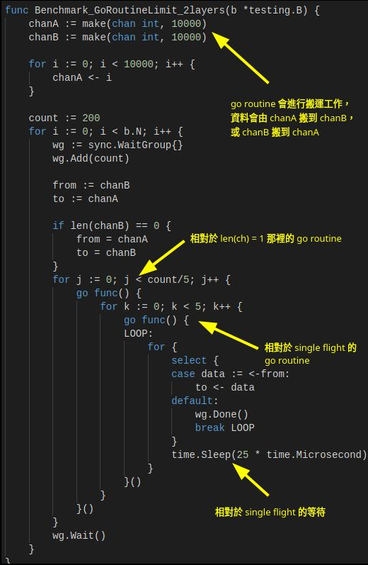  

### 解答

之前說 len(ch) == 1 不想多開 goroutine 是因為與其讓原本的 goroutine 只做 wg.Wait，不如少開一個然後原本的也一起消化 ch。

至於你問的怎麼估計要開多少 goroutine：如果你是想在 user code 做可以自動調節數量 goroutine pool 的話，我覺得可以參考 Exploration vs Exploitation 等自動優化的做法

### 問題

(1)最一開始，我是有一種想法，之前有做一個決定，就是以後有開啟 GoRoutine 的地方，數量就是由兩個值決定，由主程式的 const 變數定上限，設定檔再定修正值，這兩個值相減，就是 GoRoutine 的數量，以後所有 GoRoutine 的地方，但會個別配有這兩個值

(2)這做法有一個缺點，就是這兩個值很難觀察，很難定出來，剛好您提到 goroutine pool 和 Exploration vs Exploitation 就可以解決這些缺點

(3)但是並不是每一個有 GoRoutine 的地方都要 GoRoutine Pool，但我覺得這兩個值還是一開始就要寫出來，

因為，程式的性能和 CPU 核心數成正比，有更多個核心才能處理更多的 GoRoutine，一開始就把上限用 Benchmark 壓出來，

(4)之後，一台機器的程式會愈上愈多，會有別的程式和這隻程式干擾或搶資源，CPU 能處理我程式的 GoRoutine 的機會也愈來愈少，也開始要用設定檔的設定值開始下修

(5)之後要不要接 GoRoutine 再說，但是一開始先把這兩個值做出來，將能給程式較大的彈性，這是我之前的心得和決定

那您覺得有必要，所有 GoRoutine 的地方，個別配有這兩個值？謝謝您

### 解答

我覺得能自動持續調節的 goroutine pool 會比較好，畢竟就像你說的，那兩個 const 根本不知到要設定多少

## 2022年11月10日

### 問題

(1) GC 問題一直很頭痛，像我上次寫的一個小程式去測 GoRoutine 消散的問題，最後是覺得 GC 的會影響消散的準確性，

後來想想，要解決GC問題，小程式的話，就關閉GC，大程式的話，就用 sync.Pool，以我的狀況，像測 GoRoutine 消散的問題，是小程式，那就直接關閉 GC

(2) 我有一個疑惑，我是覺得算是不錯的問題想請教您和您討論，我覺得這問題算是不錯，我有些問題不太好

(3) 大部份的狀況，字串一開始會放在可讀區，我認為 Go 語言這樣做，可以提高高拼發時的穩定性

(4) Go語言 GC 只針對 Heap 進行回收，不過以 BinaryString 這個函式，一開始 []byte 資料一放在 stack 或者是 heap，

用 BinaryString 直接把 []byte 直接轉成 字串，如果在加上編譯器發生逃逸現象，我是覺得發生逃逸現象的機會很大，

[]byte 資料就直接移入 heap，這時就會給GC的壓力很大，您覺得我說法是否正確？謝謝

(5) 另外，時間有點晚了，昨天解另一個問題解一整天，還沒解出，Golang 很深奧

### 解答

你說的對，逃逸就會造成 GC 壓力。不過 BinaryString 這個函式應該不會是 []byte 是否逃逸的原因

### 問題

(1) 上星期是這樣想的，[]byte 資料一開始會放入 stack 式 heap，只要進入 heap 就會給 GC 壓力

(2) 這星期把問題簡化，數據量大的 []byte 較有機會進入 heap ，小的會進入 stack，先假設都規劃好了，Redis 回傳的資料都是較小的資料，那 切片 []byte 就會優先進入 stack

(3) 切片 []byte 就會優先進入 stack 的狀況下，發生函式執行結束，Stack 棧體要進行回收，那這時 切片 []byte 要移入 heap 還是 唯讀數據區 RODATA？萬一是 heap 那 GC 壓力就會大了

我內心想法，今天如果我要使用這函式 BinaryString，我的限制會很多

1 切片 []byte 不會被修改，保持 go string 唯讀的特性

2 想辨法把 BinaryString 回傳的字串就和其他 string 合拼，合成新的字串，資料複制到 唯讀數據區 RODATA，當函式結束後 切片 []byte 就直跟隨著棧體一樣被回收而消失

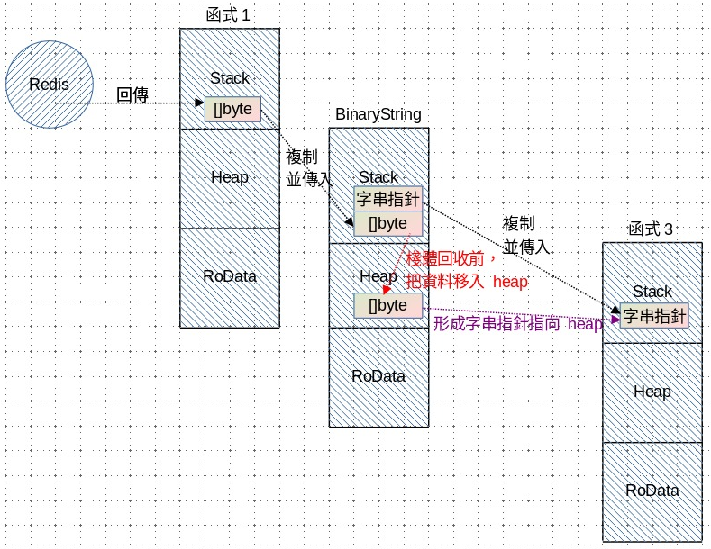 

### 解答

你可能誤會了這個 BinaryString 的用途。

通常是當你手上已經有 []byte 想要傳進 Redis Client 才會用這個 function。Redis Client 回傳的已經是 string 了。

此外並不會在棧體會收前把資料移入 heap。它會一開始就在 heap。

### 問題

了解，謝謝您，我想您是指編譯器一開始就會決定把資料放進 heap ，所以才不會在棧體回收前移入的狀況發生

如果在沒有惡意的前提下，有些人會使用 []byte 操作而不用 string 進行操作，因為 string 的效能比較慢

請教您，您是特別為這些用戶特別寫出這功能嗎？

另外，我再仔細看您的註譯，您有提到當讀取 Redis 傳回的 string，建議用 RedisMessage.AsReader

string 和 []byte，差在 string 沒有 cap 容量大小的資料，如果能由 string 長度而知道 cap 容量大小 不就是有機會可以直接轉回 []byte ？

那為何要使用 RedisMessage.AsReader？謝謝您

### 解答

對，很常有需要把 []byte 存進 redis 然後再讀出來。這樣用 BinaryString 以及 AsReader 可以避免 []byte 跟 string 轉換需要的複製

### 問題

不好意思，上星期我沒說清楚，我指的補齊容量直接轉的意思如下圖，而且這樣性能接近 CPU到寄存器的距離

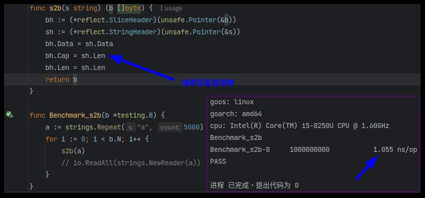 

如果是用 Reader ，最少最少會花費CPU到記憶體的時間，最少要花掉200至300奈秒，當字串愈長，就如下圖了

而且在使用 io.ReaaAll 會有 buffer 起來，也會有複制的現象，我還在想各種不同用法的使用時機？謝謝您

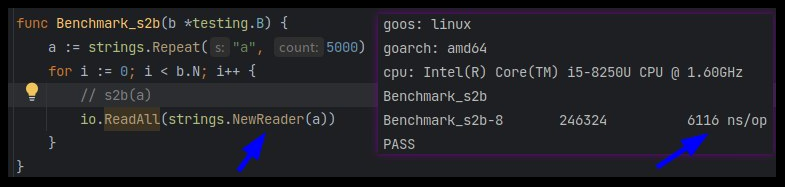   

### 解答

對，這種不用複製直接 string -> []byte 的做法我自己也常用。但它破壞 immutable string 的特性，所以不會放進 library 中

### 問題

您看看我做的表格是否合理？謝謝您Benchmark 我是用 5000 bytes 資料去做測試的

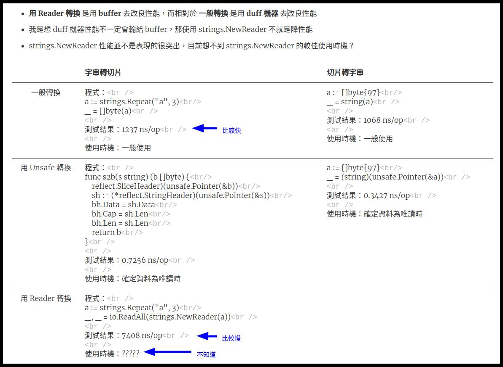 

## 2022年12月15日

### 問題

我想會使用 pipe 批量處理去增加效能，是因為TCP連線經過 (1)多syn一個ack (2)長連線 後 已經無法再優化了，所以最後只能朝 pipe 批量處理去優化，由官方文件中，[https://redis.io/docs/reference/clients/](https://redis.io/docs/reference/clients/?fbclid=IwAR16ZJRGQKGuxGmkDeyXiaErru8L7vIMFrDsBOwM-9gR8wfNnRzKklKcrSQ)，最後一段，TCP keepalive 就代表 redis 是使用長連線想來想去，想要再增加效能，只剩做長連線pool比如在 init 函式內，一次啟動5個長連線至redis，之後重複利用好處1，不會造成所有的命令集中在一個連線上好處2，逼 redis 使用多核去處理我的請求請教您會有計劃寫 長連線pool 嗎？謝謝

### 解答

已經有了喔，可以設定 PipelineMultiplex

### 問題

我看到您的一段程式碼，就來試著分析看看
其中一段
m.wire[slot].CompareAndSwap(wire, m.init)，wire 是為 interface，
那就抽 interace 的源碼來看，以 convT64 為例，會在記憶體上開一個空間，進行轉型時，會把值記錄在這，
就算 m.init 為 nil，也會在開一個空間記錄 wire 這個 interface
當連線是 broken 時，m.wire 切片全部會指向 m.init 這個記憶體位置
我是想您把 m.init 當成表示連線狀態來用？
那您為何不用 const 和 iota 來表示連線狀態？謝謝您
比如
const (
pipeInit = iota
pipeBroken
)

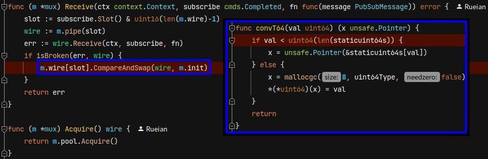

### 解答

沒什麼特別的原因 兩者都可唷

### 問題

我對整個程式碼目前不是很了解，您使用CAS去改變 wire 狀態的方法我也想使用，
所以我就寫了一個小型的程式去進行了解，
mInit 為初始狀態
mDead 為死亡狀態
最後會變成 mInit 等於 mDead，意思為出生等於死亡，我是覺得不合理
請教您，您覺得我這段程式是那裡有問題？謝謝您

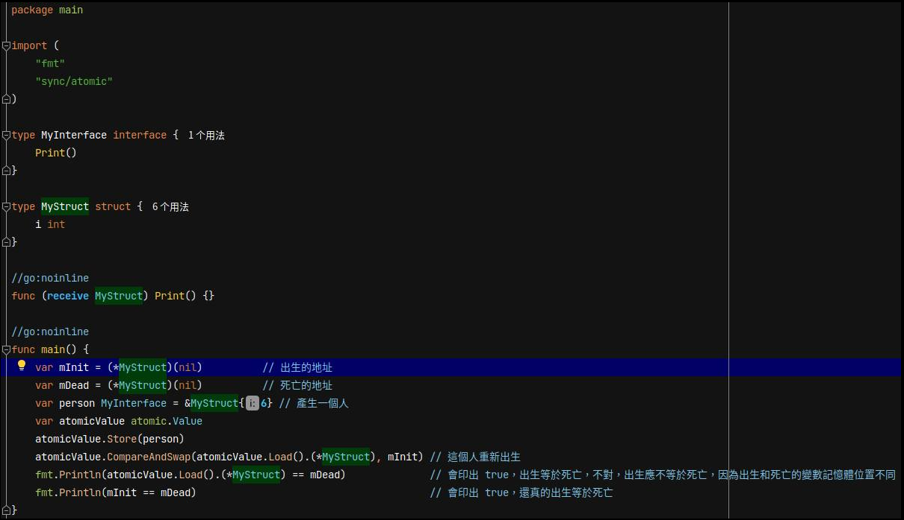

### 解答

mInit == mDead 是因為 (*MyStruct)(nil) == (*MyStruct)(nil)
如果你要比地址的話應該是要用 &mInit != &mDead

### 問題

不過 (*MyStruct)(nil) 上面有星號指標，就是地址
我當時就在想，會不會是有的時候，表面上程式寫的，但私底下程式不一定是這樣運作
這也不是不可能，指針接收器的元素賦值就是一個例子
謝謝您

鎖有等級，如果換成較輕量的 CAS 也不錯，但是後來發現，如下圖，反而在因初始化這些狀態時，反而傷性能，數據如下
Benchmark_Status
Benchmark_Status/using_cas
Benchmark_Status/using_cas-8 3446288 340.5 ns/op
Benchmark_Status/using_lock
Benchmark_Status/using_lock-8 7467360 166.3 ns/op
您的程式才兩個狀態，一個為init，另一個為 dead ，所以這影響不明顯
如果能在程式切換狀態時不上互斥鎖，改用CAS，我也願意，但是目前看起來不理想(如果別人說這樣程式會難讀，我就注譯寫清楚一點就好)
請教您，您會不會在切換
mInit初始狀態 和 mDead死亡狀態 時，考慮使用互斥鎖？效能也許會比較好，謝謝您

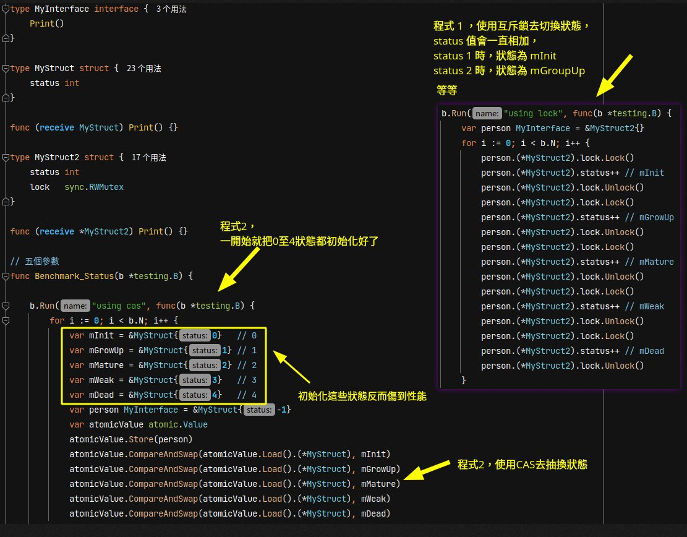

### 解答

應該要把初始化搬到迴圈之外，另外應該要用 parallel benchmark 比較 synchronization 比較有意義

### 問題

用 CAS 去控制物件狀態是高難度，原因有
1 互斥鎖可以承受高度競爭，但CAS不行
2 每行程式執行順序不同，CAS無法去控制這問題
3 效能目前看起來沒有比較好
互斥鎖雖然把並聯操作成串聯，CAS沒有這個現象，要是我去選，也會選CAS，但是CAS也不是十全十美
白天我再花時間去解釋我的理解，我先附上測試的程式碼
原本也是以為CAS會比較好，後來發現會有這些問題，謝謝您
程式碼

```go
package status

import (
	"log"
	"sync"
	"sync/atomic"
	"testing"
)

const (
	statusInit = iota
	statusGroupUp
	statusMature
	statusWeak
	statusDead
)

type MyInterface interface {
	Set()
}

type MyStruct struct {
	status atomic.Value
	task   int
}

type MyStructStatus struct {
	status int
}

func (receive *MyStruct) Set(mInit, mGrowUp, mMature, mWeak, mDead *MyStructStatus) {
LOOP:
	for {
		switch receive.status.Load().(*MyStructStatus) {
		case mInit:
			if result := receive.status.CompareAndSwap(mInit, mGrowUp); result == true {
				receive.task = receive.task + 1
				break LOOP
			}
		case mGrowUp:
			if result := receive.status.CompareAndSwap(mGrowUp, mMature); result == true {
				receive.task = receive.task + 2
				break LOOP
			}
		case mMature:
			if result := receive.status.CompareAndSwap(mMature, mWeak); result == true {
				receive.task = receive.task + 4
				break LOOP
			}
		case mWeak:
			if result := receive.status.CompareAndSwap(mWeak, mDead); result == true {
				receive.task = receive.task + 8
				break LOOP
			}
		case mDead:
			break LOOP
		default:
			//
		}
	}
}

// 不使用
/*func (receive *MyStruct) Set(mInit, mGrowUp, mMature, mWeak, mDead *MyStructStatus) {
	for {
		if receive.status.CompareAndSwap(mInit, mGrowUp) {
			receive.task = receive.task + 1
			break
		} else if receive.status.CompareAndSwap(mGrowUp, mMature) {
			receive.task = receive.task + 2
			break
		} else if receive.status.CompareAndSwap(mMature, mWeak) {
			receive.task = receive.task + 4
			break
		} else if receive.status.CompareAndSwap(mWeak, mDead) {
			receive.task = receive.task + 8
			break
		} else if receive.status.Load().(*MyStructStatus) == mDead {
			break
		}
	}
}*/

type MyStruct2 struct {
	status int
	task   int
	lock   sync.Mutex
}

func (receive *MyStruct2) Set() {
	receive.lock.Lock()
LOOP:
	for {
		switch receive.status {
		case statusInit:
			receive.task = receive.task + 1
			receive.status = statusGroupUp
			receive.lock.Unlock()
			break LOOP
		case statusGroupUp:
			receive.task = receive.task + 2
			receive.status = statusMature
			receive.lock.Unlock()
			break LOOP
		case statusMature:
			receive.task = receive.task + 4
			receive.status = statusWeak
			receive.lock.Unlock()
			break LOOP
		case statusWeak:
			receive.task = receive.task + 8
			receive.status = statusDead
			receive.lock.Unlock()
			break LOOP
		case statusDead:
			receive.lock.Unlock()
			break LOOP
		default:
			//
		}
	}
}

var mInit = &MyStructStatus{0}   // 0
var mGrowUp = &MyStructStatus{1} // 1
var mMature = &MyStructStatus{2} // 2
var mWeak = &MyStructStatus{3}   // 3
var mDead = &MyStructStatus{4}   // 4

// 五個參數
func Benchmark_Status(b *testing.B) {
	b.Run("using cas", func(b *testing.B) {
		for i := 0; i < b.N; i++ {
			person := MyStruct{}
			person.status.Store(mInit)
			wg := sync.WaitGroup{}
			wg.Add(5)
			for j := 0; j < 5; j++ {
				go func() {
					person.Set(mInit, mGrowUp, mMature, mWeak, mDead)
					wg.Done()
				}()
			}
			wg.Wait()
			// time.Sleep(300 * time.Microsecond) // 加這一行，測試會通過，應是每行程式執行順序不同的原因
			if person.task != 15 {
				log.Fatal("error", person.task)
			}
		}
	})
	b.Run("using lock", func(b *testing.B) {
		var person MyInterface = &MyStruct2{
			status: 0,
		}
		for i := 0; i < b.N; i++ {
			wg := sync.WaitGroup{}
			wg.Add(5)
			for j := 0; j < 5; j++ {
				go func() {
					person.Set()
					wg.Done()
				}()
			}
			wg.Wait()
			if person.(*MyStruct2).task != 15 {
				log.Fatal("error", person.(*MyStruct2).task)
			}
		}
	})
}

```

這是圖1(共有三張圖)，先做測試邏輯說明，這是測試的邏輯說明，所有的協程都會去進行 task 值的相加，最後 task 總合應要為 15，不然測試失敗
原本是想，如果測試效果很好，就把這一套機制寫成一個 package，愈做愈精緻，不過目前是有些狀況
鎖的學問大，Go 的鎖的種類應有 5 6 種，也算是值得討論

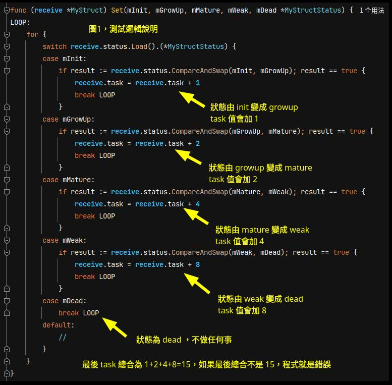 

圖2(共有三張圖)為我所認為的 CAS 的缺點，在執行CAS的過程中，會和迴圈一起配合，如果協程數量一多，程式因處理大量迴圈反而會傷性能

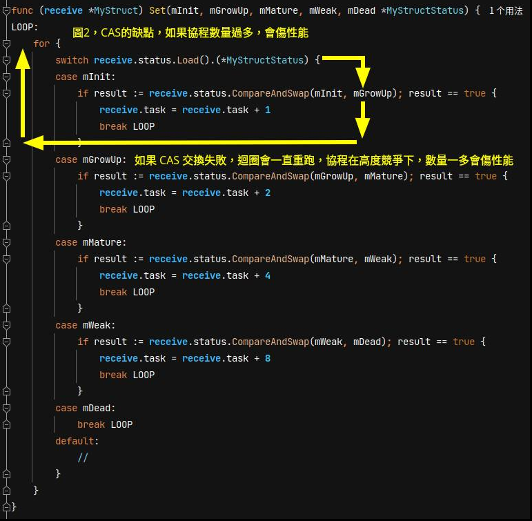 

圖3(共有三張圖)為我所認為的 CAS 會遇到的另一個問題，程式執行的順序不會依照我想像中的順序去執行，如果使用 CAS 去控制物件狀態，這個問題會變的更嚴重
看來看去，除非是今天 CAS 在這方面，效能 比 互斥鎖好太多，我才會冒險使用 CAS
互斥鎖把並聯問題改成串聯，我也不是很喜歡，但為了要躲互斥鎖，反正製造二個新問題，可能划不來
另一個問題是，進行測試，CAS的效能也沒有好多少，差距不大
請教您，您覺得我所認為的 CAS 的兩個缺點，可解嗎？謝謝您

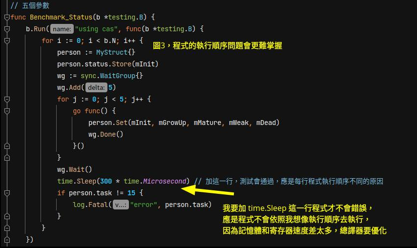 

### 解答

你應該要用 atomic 操作 person.task 不然都會是錯的

```go
package main

import (
	"math"
	"sync"
	"sync/atomic"
	"testing"
)

type ss struct{ v int64 }

var status = []*ss{nil}
var sum int64

func init() {
	for i := float64(0); i < 4; i++ {
		status = append(status, &ss{v: int64(math.Pow(2, i))})
		sum += status[len(status)-1].v
	}
}

type MyStruct interface {
	Set()
	Load() int64
}

type MyAtomicStruct struct {
	status atomic.Pointer[ss]
	tasks  atomic.Int64
}

func (ms *MyAtomicStruct) Set() {
	for i, ss := range status[1:] {
		if ms.status.CompareAndSwap(status[i], ss) {
			ms.tasks.Add(ss.v)
			return
		}
	}
}

func (ms *MyAtomicStruct) Load() int64 {
	return ms.tasks.Load()
}

type MyLockedStruct struct {
	mu     sync.Mutex
	status *ss
	tasks  int64
}

func (ms *MyLockedStruct) Set() {
	ms.mu.Lock()
	defer ms.mu.Unlock()
	for i, ss := range status[1:] {
		if ms.status == status[i] {
			ms.status = ss
			ms.tasks += ss.v
			return
		}
	}
}

func (ms *MyLockedStruct) Load() int64 {
	ms.mu.Lock()
	defer ms.mu.Unlock()
	return ms.tasks
}

func Benchmark(b *testing.B) {
	bench := func(name string, ms MyStruct) {
		b.Run(name, func(b *testing.B) {
			b.RunParallel(func(pb *testing.PB) {
				for ; pb.Next(); ms.Set() {
				}
			})
		})
		if v := ms.Load(); v != sum {
			b.Fatalf("unexpected %v != %v", v, sum)
		}
	}
	bench("Atomic", new(MyAtomicStruct))
	bench("Locked", new(MyLockedStruct))
}

```

### 問題

我在想，為何您會指出，為何程式要用 atomic 才不會有錯誤
把整個 atomic 的底層打開來看，會看到 LOCK instruction，
我還在想 LOCK 是什麼東西，應該是編譯器和硬體層級的鎖，可能是由 關掉中斷、鎖總線或MESI去實作 等方法去實作，這些底層黑盒子我暫時應不用再繼續打開
總而言之，我想您會認為都要用 atomic ，程式才不會出錯，主要的原因是 atomic 會上鎖，而且是 硬體層級的鎖
請教您是不是這樣想的？謝謝您

### 解答

只是因為你的 receive.task 有可能會同時被多個 goroutine 寫入而已，所以才需要要用 atomic

### 問題

大家都說您很厲害，但沒有切確的形容是怎麼的厲害法
我後來發現，您沒有使用一些 Golang 本身的優化機制，都還能把效能寫的這麼強，不是每個人有這種功力
比如，在這裡，您使用 CAS 而不使用互斥鎖
互斥鎖有一個特點，當協程在飢餓時，其他協程就會停止自旋，還有喚醒在二叉樹裡等待協程的功能，設計也是很精密
我就直接把事實說出來了

 

我有一個額外的問題想要請教您，這問題是為何大家喜歡用 parallelism 平行處理 這個名詞？
就連我在 IDE 上也可以看到這個字，您有時也會提到，其他人寫部落格或博客也會提到
我是在想，平行處理 應只是理想的狀態，但在實際的狀況下，很少會存在
原因1，官網有提到 Go 語言是併發語言，不是平行處理的語言
原因2，如果作業系統有重要的工作，會把CPU資源搶走，Go Scheduler 應很難真正做到 平行處理 的狀態
我想大家所提到的平行處理應是指 **近似平行處理**，而不是真正的平行處理
謝謝您

### 解答

是的 你說的沒錯


